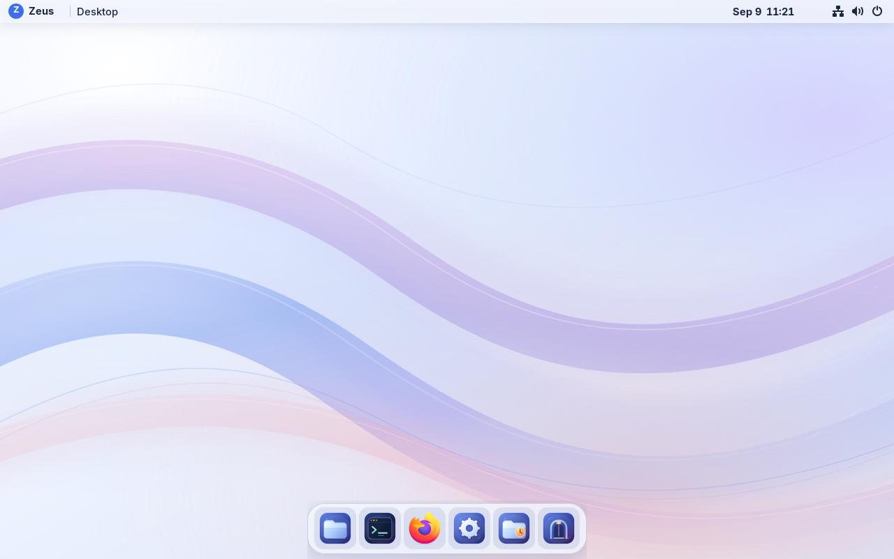

# Zeus OS

A focused Fedora bootc laptop desktop with a macOS-inspired layout, original Zeus artwork, and native GNOME security and accessibility.

The current version is **0.1.0-preview.2**. It includes a translucent top bar and floating dock, original icons, traffic-light window controls, compact application search (Super+Space), coordinated light/dark artwork, and a branded native login screen. GNOME/Wayland runs Files, Firefox, Ptyxis, Settings, and Welcome. The Rust `zeus` helper provides diagnostics, safe desktop fallback, signed updates, and validated SSH launch.

The latest build adds signed native **Updates** for owner-triggered preview upgrades while retaining clearer **Temp downloads**, permanent saves, Files shortcuts, event-driven desktop updates and laptop power defaults. It removes periodic Temp cleanup checks when using On boot or Never. [Latest iteration and verification](docs/iterations/git-17d205103f3a/README.md) records the native installation, explicit restart, and timestamped measurements. Physical battery remains unmeasured on the review VM; see the [timestamped metrics history](docs/metrics.md) for runtime observations.



Deployment and measured results are recorded in the [preview VM runbook](docs/preview-vm.md) and [release notes](docs/releases/preview-2.md). An image build alone is not a graphical or performance test.

The [timestamped metrics history](docs/metrics.md) keeps measurements, testing
conditions and regressions together across builds.

We keep this version fixed while iterating. Each update has its own Git build ID; see the [iteration build policy](docs/iteration-builds.md).

## Build

Build on a dedicated Linux VM with rootful Podman, Python 3, Git and QEMU tools. Image assembly needs privileged container access; use the isolated builder, not a production host or the development VM.

```sh
git clone https://github.com/KanterLabs/zeusos.git
cd zeusos
sudo ./scripts/build.sh
sudo ./scripts/build-disk.sh
```

[Image inputs](image/inputs.json) pin the Fedora base and maintained osbuild builder by digest. Fedora RPM signatures are checked during assembly; the exact resolved package inventory is captured in `out/packages.lock`. RPM repositories are not snapshot-pinned yet, so later rebuilds can resolve newer packages. The source revision and installed package inventory are also embedded under `/usr/share/zeus/`.

The output `out/disk/qcow2/disk.qcow2` contains no owner password or SSH key. Initial owner setup uses a private Proxmox NoCloud seed; see [deployment instructions](docs/preview-vm.md). Keep account secrets outside Git and preserve the existing guest and owner state on later updates.

## Desktop tools

```sh
zeus version
zeus doctor --json
zeus desktop safe
zeus desktop restore
zeus update status
zeus update check
zeus update install
zeus dev --target user@your-dev-host
```

Safe desktop disables the optional Zeus shell and dock and removes managed GTK styling imports; native GNOME remains usable and personal files and preferences stay in place. Applying an OS update or reboot is always explicit. The preview does not configure an unattended update channel.

Open **Updates** from application search or **Welcome → Open Updates** to check
for a signed preview build, review its notes, and install it after administrator
authentication. Installation continues after closing the window. **Restart to
Apply** is a separate action; the normal Temp cleanup policy also applies to
update reboots. See the [updater contract](docs/features/os-updater.md).

## Validation

```sh
cargo fmt --manifest-path zeus/Cargo.toml --check
cargo test --manifest-path zeus/Cargo.toml --locked --offline
python3 -m unittest discover -s tests -v
```

GitHub Actions uses `homelab` for image policy checks and `homelab-heavy` for Rust compilation/tests. Runtime validation uses the actual review VM, including native login, application launches, stock-shell fallback, data preservation and idle sampling. [Measurement budgets](docs/releases/preview-1-budgets.md) were declared before the first desktop boot.

## Roadmap

The [next proposed iteration](docs/next-iteration.md) breaks Settings, better
search and optional app installation into implementation and testing checklists.

The review VM now has a qualified signed preview updater for owner-triggered Updates. Production release channels, release promotion, signing-key rotation and recovery policy, the full remote T3/Codex workflow, personal profile recovery, encrypted interactive installer, and physical laptop qualification remain separate implementation work. Preview qualification does not define production release or key-rotation policy.

- [Preview strategy](docs/preview-strategy.md)
- [Implementation checklist](docs/implementation-plan.md)
- [Testing checklist](docs/testing-plan.md)
- [Helm backlog](docs/helm-backlog.md)
- [Original design](docs/design-v0.1.md)
- [Planning overview](docs/backlog-overview.md)

Project code is MIT licensed. Original desktop artwork is CC0-1.0; Fedora packages retain their upstream licenses.
