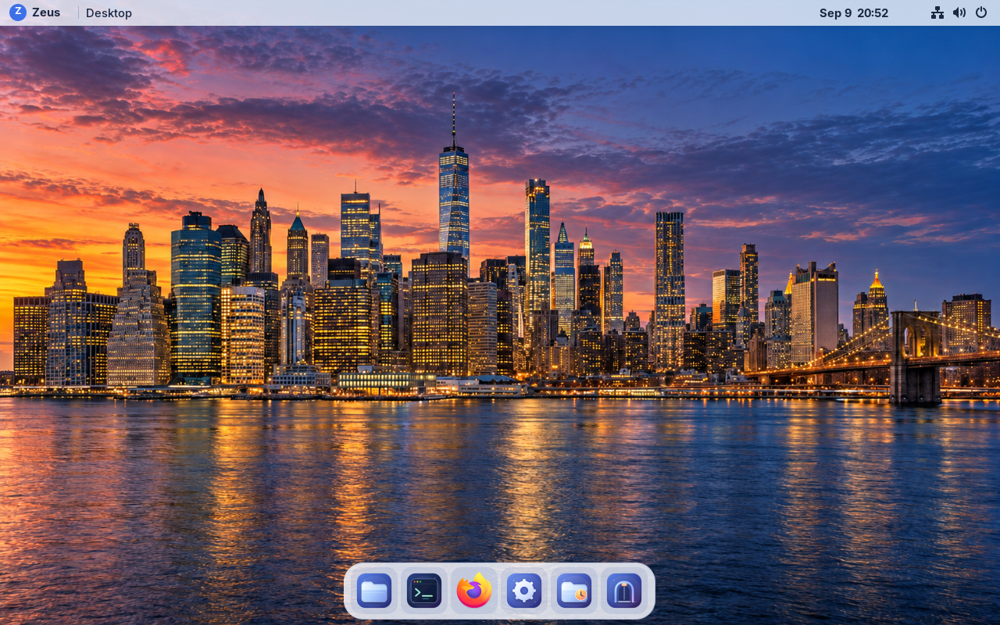

# Zeus OS

A focused Fedora bootc laptop desktop with a macOS-inspired layout, original Zeus artwork, and native GNOME security and accessibility.

The current version is **0.1.0-preview.2**. It includes a translucent top bar and floating dock, original icons, traffic-light window controls, compact application search (Super+Space), a New York dusk wallpaper, and a branded native login screen. GNOME/Wayland runs Files, Google Chrome, Ptyxis, Settings, and Welcome. The Rust `zeus` helper provides diagnostics, safe desktop fallback, signed updates, and validated SSH launch.

The latest build adds **Codex CLI 0.154.0** as an official standalone package.
Run `codex` in Terminal and sign in with your own account. [Screenshots and
verification](docs/iterations/git-f080c2d9bc53/README.md) record the deployed
package, sandbox checks and measurements. Product version remains **0.1.0-preview.2**.

**Official Google Chrome Stable** remains the dock and web-link default, with
new downloads going to **Temp**. Background apps default off, and browser and
Codex upgrades arrive through signed Zeus Updates. The
[Chrome iteration](docs/iterations/git-9c2cfbdcb703/README.md) retains its earlier
deployment and preservation evidence.

**New York at dusk** remains the desktop, lock screen and native login background. City and gradient backgrounds stay selectable in **Settings → Appearance**. The [first-laptop checklist](docs/laptop-readiness.md) records the Nimo N154G target and the remaining hardware and migration checks.



**Zeus Settings** remains available from the Zeus menu, Welcome or application search for network, Bluetooth, displays, power, sound, appearance, Temp and Updates. The Zeus menu also includes bounded [Tailscale status and connection controls](docs/features/tailscale.md). Physical battery remains unmeasured on the review VM; see the [metrics history](docs/metrics.md).

Deployment and measured results are recorded in the [preview VM runbook](docs/preview-vm.md) and [release notes](docs/releases/preview-2.md). An image build alone is not a graphical or performance test.

The [timestamped metrics history](docs/metrics.md) keeps measurements, testing
conditions and regressions together across builds.

We keep this version fixed while iterating. Each update has its own Git build ID; see the [iteration build policy](docs/iteration-builds.md). The planned [repository-backed Developer Mode](docs/features/developer-mode.md) adds a fast, reversible desktop-extension lane while keeping every applied change tied to a pushed Git commit and the next immutable image.

## Install alongside Fedora

The [Fedora Zeus Installer](installer/README.md) adds a separate Zeus system
through Fedora's existing boot menu, with a default 128 GiB allocation and
Fedora kept as the default choice. It targets the documented Fedora 43,
unencrypted Btrfs, UEFI layout with Secure Boot disabled. No USB or firmware
setup was needed in the VM rehearsal.

The installer is a **VM-tested preview**; the Nimo laptop remains untested.
Partition changes require a verified backup receipt. The [qualification
record](docs/iterations/installer-20260910/README.md) records the clean install,
preserved files, offline boots, update/rollback checks and remaining limits.
Installer-managed multi-OS systems have a source-implemented, fail-closed
[Shut Down to Boot Chooser](docs/features/boot-chooser-shutdown.md) action that
uses a one-shot firmware selection without changing the default OS.

## Build

Build on a dedicated Linux VM with rootful Podman, Python 3, Git and QEMU tools. Image assembly needs privileged container access; use the isolated builder, not a production host or the development VM.

```sh
git clone https://github.com/KanterLabs/zeusos.git
cd zeusos
sudo ./scripts/build.sh
sudo ./scripts/build-disk.sh
```

[Image inputs](image/inputs.json) pin the Fedora base and maintained osbuild builder by digest. Fedora RPM signatures are checked during assembly; the exact resolved package inventory is captured in `out/packages.lock`. RPM repositories are not snapshot-pinned yet, so later rebuilds can resolve newer packages. The source revision and installed package inventory are also embedded under `/usr/share/zeus/`.

The output `out/disk/qcow2/disk.qcow2` contains no owner password or SSH key. Initial owner setup uses a private Proxmox NoCloud seed; see [deployment instructions](docs/preview-vm.md). Keep account secrets outside Git and preserve the existing guest and owner state on later updates.

## Desktop tools

**Codex CLI** is included as an official standalone package. Open Terminal in
your project and run `codex`, then sign in with your own account. This command
runs locally; the full remote T3/Codex launcher remains planned. No Node runtime
or Codex boot service is added. See [Codex packaging and usage](docs/features/codex-cli.md).

**Tailscale** is built into the image. Open **Zeus → Tailscale** to see this
device's connection state, connect or disconnect, and open the normal browser
sign-in when enrollment is needed. The menu never lists peers or accepts auth
keys. See the [Tailscale UI and security contract](docs/features/tailscale.md).

```sh
codex --version
zeus version
zeus doctor --json
zeus desktop safe
zeus desktop restore
zeus update status
zeus update check
zeus update install
zeus dev --target user@your-dev-host
```

Safe desktop disables the optional Zeus shell, dock and lock effects and removes managed GTK styling imports; native GNOME remains usable and personal files and preferences stay in place. Applying an OS update or reboot is always explicit. The preview does not configure an unattended update channel.

Open **Updates** from application search or **Welcome → Open Updates** to check
for a signed preview build, review its notes, and install it after administrator
authentication. Installation continues after closing the window. **Restart to
Apply** is a separate action; the normal Temp cleanup policy also applies to
update reboots. See the [updater contract](docs/features/os-updater.md).

## Validation

```sh
cargo fmt --manifest-path zeus/Cargo.toml --check
cargo test --manifest-path zeus/Cargo.toml --locked --offline
python3 -m unittest discover -s tests -v
node --test tests/lock_background.test.mjs
```

GitHub Actions uses `homelab` for image policy checks and `homelab-heavy` for Rust compilation/tests. Runtime validation uses the actual review VM, including native login, application launches, stock-shell fallback, data preservation and idle sampling. [Measurement budgets](docs/releases/preview-1-budgets.md) were declared before the first desktop boot.

## Roadmap

The [additions plan](docs/next-iteration.md) tracks the delivered Settings work
and separate implementation/testing checklists for [AirPods support](docs/features/airpods.md),
better search and optional app installation. AirPods software prerequisites are
verified; real-device qualification and optional battery/noise controls remain open.

The review VM now has a qualified signed preview updater for owner-triggered Updates. Production release channels, release promotion, signing-key rotation and recovery policy, the full remote T3/Codex workflow, personal profile recovery, encrypted interactive installer, and physical laptop qualification remain separate implementation work. Preview qualification does not define production release or key-rotation policy.

- [Preview strategy](docs/preview-strategy.md)
- [Implementation checklist](docs/implementation-plan.md)
- [Testing checklist](docs/testing-plan.md)
- [Developer Mode plan](docs/features/developer-mode.md)
- [Boot chooser shutdown plan](docs/features/boot-chooser-shutdown.md)
- [Helm backlog](docs/helm-backlog.md)
- [Original design](docs/design-v0.1.md)
- [Planning overview](docs/backlog-overview.md)

Project code is MIT licensed. Original desktop artwork is CC0-1.0; Fedora packages,
Google Chrome, and Codex with its bundled helpers retain their upstream licenses.
[Codex notices](image/licenses/codex/README.md) are also installed with the image.
Chrome is Google's official proprietary browser; its binaries and trademarks are
not covered by the Zeus code or artwork licenses.
