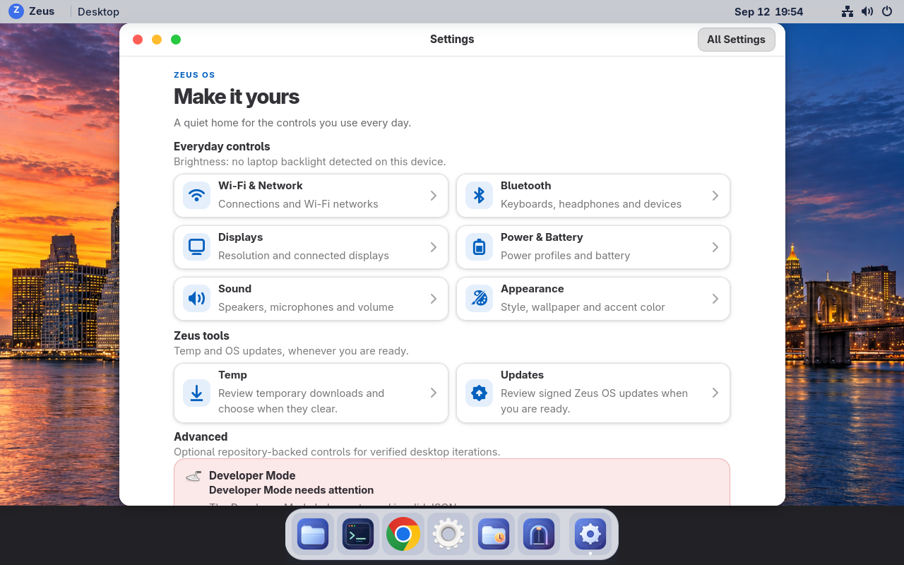
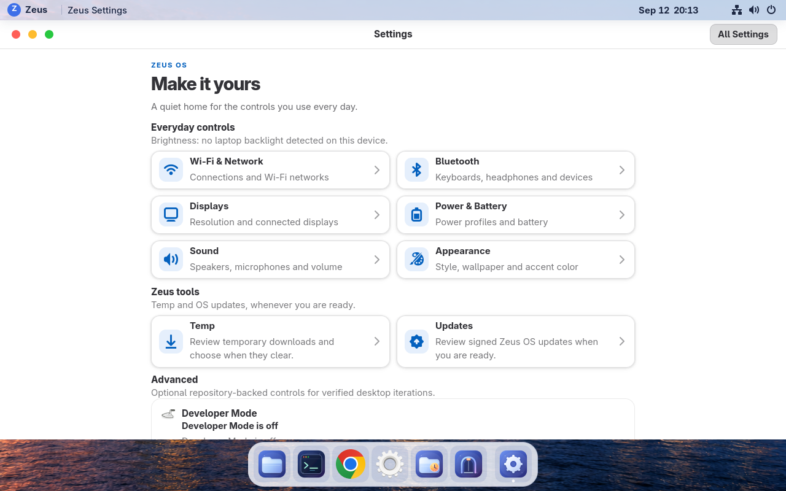

# Developer Mode final-image qualification — 2026-09-12

Build `git-97da2a1116c4` (source
`97da2a1116c40c383d0bb980712da2fbae1a9439`) passed the installed-image
Developer Mode qualification on disposable Fedora 44 VM119. The same signed
build is promoted on the preview feed and booted on VM118 and VM119.

## Results

- The installed `zeus developer status --json` reported a clean disabled
  state with exact base build and image provenance. The historical `zeus dev`
  SSH command remains separate.
- The prepare phase merged, unmerged, and re-merged the fixed directory
  extension; rejected incompatible `VERSION_ID` and `SYSEXT_LEVEL` fixtures;
  and restored the exact base sentinel.
- After an operator-controlled reboot, the changed boot ID and active
  `systemd-sysext.service` proved boot activation. Final cleanup restored the
  exact base sentinel and empty extension list.
- SELinux remained enforcing with zero relevant AVC denials. The safe-desktop
  dry-run kept the terminal available and reported credentials and personal
  data untouched.
- The installed service is enabled and active with no resident extension left
  after cleanup. The final status is `state: disabled`, `ok: true`, and
  `required_action: none`.

The complete machine-readable phase records are [prepare.json](prepare.json)
and [verify.json](verify.json). Installed CLI output is retained in
[developer-status.json](developer-status.json) and [runtime.txt](runtime.txt).

## Settings regression found and fixed

The first installed screenshot found that Settings truncated the helper's JSON
at 512 bytes before parsing it. A healthy disabled response was therefore
rendered as a red **Developer Mode needs attention** card. The UI now preserves
up to 64 KiB of bounded status JSON for parsing while keeping ordinary display
and error text bounded to 512 bytes. A regression test covers a response over
1 KiB.

| Before (`git-eaabf4da5796`) | After (`git-97da2a1116c4`) |
| --- | --- |
|  |  |

The screenshots are the native installed Settings window on VM119 at 1280×800,
not a mockup. The after capture is maximized; the desktop dock overlaps the
lowest part of the scrollable card, but the corrected status and neutral card
surface are visible.

## Measurement limits

The prepare phase recorded 10-second five-sample idle windows after five
seconds of settling: the base/disabled median was 0.249% aggregate guest CPU
and 848.3 MiB used memory; merged was 0.373% and 846.2 MiB. After reboot,
merged was 0.496% and 889.1 MiB; post-cleanup disabled was 0.373% and 870.4 MiB.
These short VM observations are mechanism evidence, not a controlled
performance comparison or a physical-laptop battery claim.

The active boot observation was 8.301 seconds total. It is not paired with a
same-condition disabled cold boot, so no boot-time improvement or regression
is claimed.
