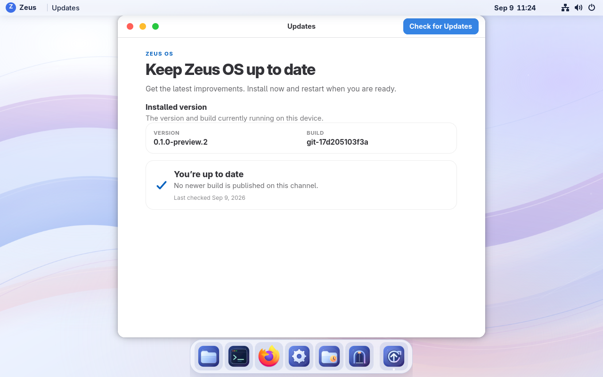

# Signed native Updates — September 9, 2026

VM 115 runs **0.1.0-preview.2**, build **git-17d205103f3a**. This is another
iteration of the same preview. The [receipt](build-receipt.json) identifies the
booted image, signed archive, retained predecessor, and qualification results.

## Use Updates

Open **Welcome → Open Updates**, or press **Super+Space**, search for
**Updates**, and press Enter. Check for a build, read its notes, and choose
**Install Update**. Native administrator authentication authorizes installation.
The background job continues if the window closes; reopening shows its current
progress. **Restart to Apply** is a separate action with a save-work reminder
and native GNOME confirmation. The configured Temp policy applies to update
reboots too.

The app checks once when opened and when requested. No update timer or
unattended reboot is enabled. Local status and the open window follow state
changes without idle polling. The installed build ID distinguishes iterations
that share the product version.

## Verified update path

The previous [bootstrap image A](../git-21a465760f53/README.md) introduced the
updater through the existing manual bootc path. A then installed
[intermediate B](../git-1a34bbfe8509/README.md) through the real native app.
That test exercised authentication cancellation, successful retry, closing
during download, and reopening during staging. B's stale installed-status text
and unavailable status icon were corrected in this final payload.

B installed this final build through Updates in **55.149 seconds**, including
authentication entry, signed metadata fetch, download, staging, and up to three
seconds of status-probe overhead. The [timing record](native-install-timing.json)
contains actual UTC bounds. [Bootc status before restart](staged-bootc.json)
shows the exact signed candidate staged while B was still running. The app did
not reboot until the explicit restart action.

After that restart, [booted status](booted-bootc.json) identifies the final
signed digest and retains B for rollback. Before any new network check,
[local status](installed-status-before-check.json) reports the final build as
installed with the corrected message. A separate [native update-boot
record](native-update-boot.json) retains that warm-reboot observation.

The signed feed and every uploaded artifact's size and digest were checked;
see [asset verification](asset-verification.json). The private signing key was
never placed on the builder or in the image. Root installation independently
verifies the signed selection, download checksum, OCI identity, update sequence,
free space, and existing staged state before invoking bootc.

## Measurements and data preservation

The [metrics history](../../metrics.md) keeps timestamped cold-boot, idle, and
update observations with all raw samples and test conditions. Three cold starts
measured median **6.849 seconds** OS startup and **18.541 seconds** from the
host start command to SSH/GDM readiness. The latter includes firmware and
probe overhead; it is not first-pixel time. The builder was stopped for these
measurements, while the shared Proxmox host remained otherwise unisolated.

The two-minute [closed-desktop sample](idle-closed.json) measured median
**0.15% CPU / 964.6 MiB**; the [Updates-open sample](idle-updates-open.json)
measured **0.15% CPU / 1,029.5 MiB**. Neither recorded a Temp cleanup
activation. Both used 20 seconds settling, five-second samples, and an awake
display. These whole-guest observations are not a controlled comparison with
the earlier long-lived pre-updater session or a battery result.

The fresh populated backup passed zstd and decompressed VMA verification before
the first update. Six permanent-file hashes and the existing 48-byte Temp
sample survived both native updates. Temp was temporarily held at Never for
qualification boots and restored through its normal policy API afterward.
There was no backup restore, reinstall, account reseed, or disk replacement.
The [final hash checks](preserved-final.txt) and [restored Temp state](temp-restored.json)
also confirm that a cleanup-service restart in the same boot preserved the
sample. [Runtime health](runtime-health.json) confirms Secure Boot, enforcing
SELinux, zero failed system/user units, and inactive installer and Temp timer.

The retained B binary uses the same mutable updater schema and Temp backend.
Populated-state tests cover preservation and unsupported-schema rejection.
No VM rollback/re-forward cycle was run in this iteration.

## Validation and limits

[Source CI](payload-ci.json) passed all **123 Python tests**, including 47
updater trust, transaction, and window tests, plus Rust formatting, compilation,
and CLI contracts. [Installed-image checks](image-validation.log) validated
82 GNOME settings, GTK3/GTK4 themes, Updates imports and styling, the Polkit
policy, service definition, installed trust key, and immutable build identity.

This preview distributes a full OCI archive, approximately 1.7 GiB, for the
existing installation. A new installer or disk image was not built. The VM
has no physical battery or laptop GPU: these measurements do not establish
battery runtime, wattage, suspend drain, or physical graphics performance.
Production release policy, signing-key rotation, and full laptop qualification
remain separate work.
