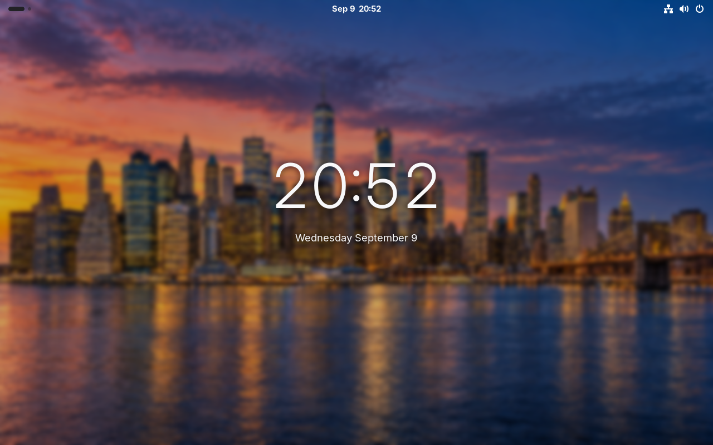
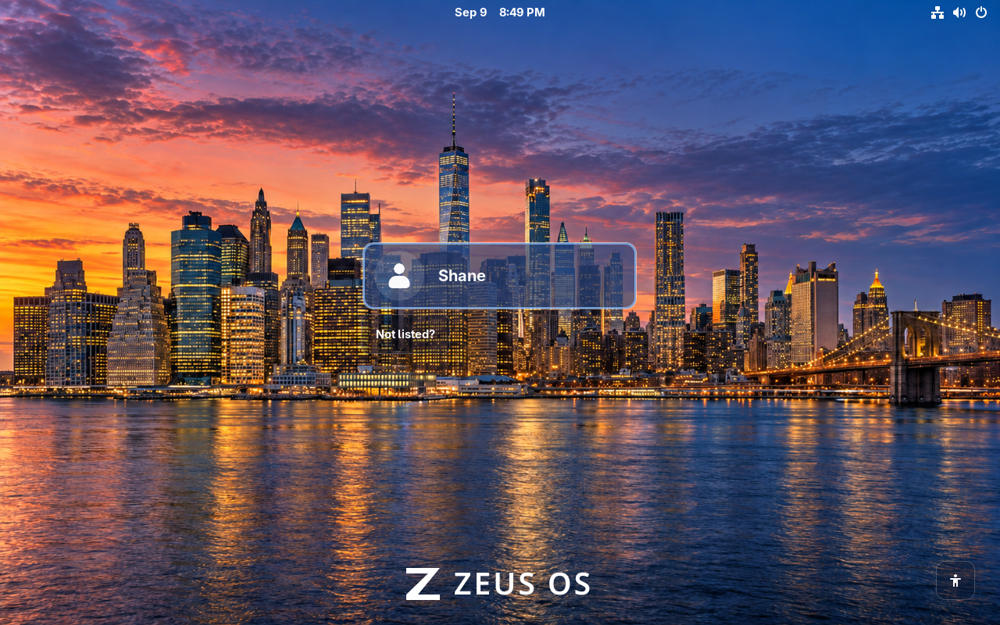
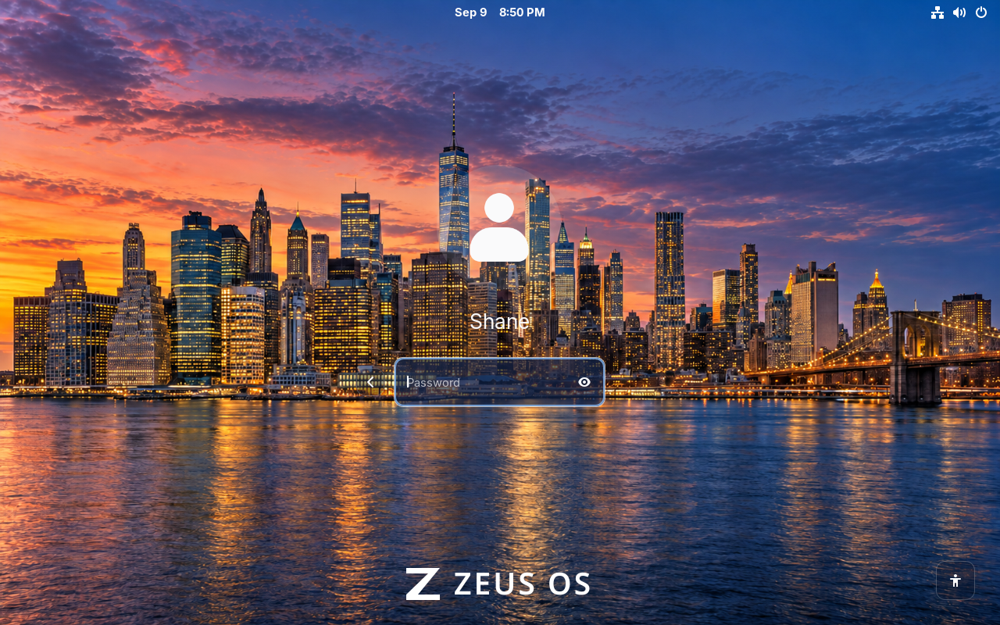
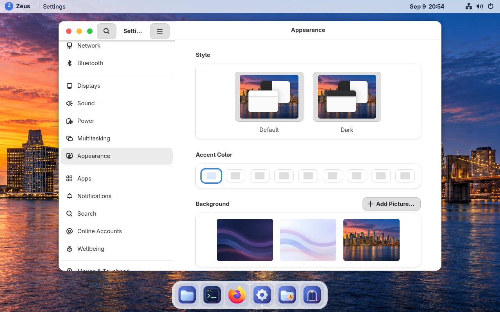
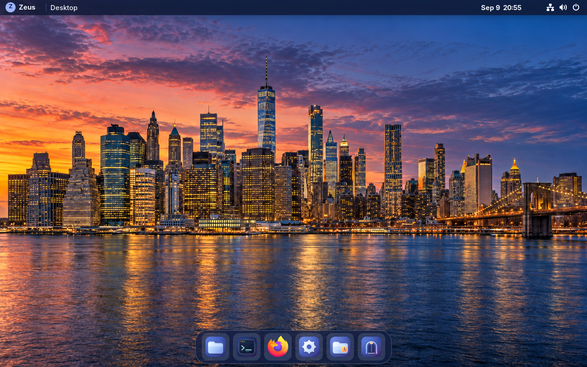

# New York at dusk — September 9, 2026

VM **115** runs **0.1.0-preview.2**, build **git-31f0851a9d07**. The desktop,
lock and native login share New York dusk artwork, with a lighter lock clock and
restrained translucent login controls. Open **Settings → Appearance** to choose
the city or retained light/dark gradients. The [receipt](build-receipt.json)
identifies the signed image and verification.

## Lock and login

The lock effect changes only the existing native background blur and brightness.
Native password handling, input and authentication remain in GNOME. It uses
signals and one-shot idle work, with no polling loop, network request, new
package or background service. Safe desktop restores stock blur; high contrast
retains the original GNOME presentation. A changed private GNOME background
actor path falls back to stock blur.

The [installed UI record](installed-ui-verification.json) covers user selection,
password entry, successful login, three successful lock/unlock cycles, native
unlock at 200%, monitor-scale changes while locked, high contrast, reduced motion
and safe fallback. Native layouts were checked at 1280×800/100% and
1920×1200/200%. GNOME's Appearance picker selected the retained Light gradient
and then the city. Light/dark styles were checked and the original light
preference restored. No extension errors appeared in the user journal.

The image is generated photographic-style artwork with a native size of
**1586×992**. The built-in generation tool, saved asset and complete prompts are
recorded in [artwork provenance](../../artwork/new-york-dusk.md). It is not a
4K master. These screenshots came from the deployed VM.

## Signed update and preservation

The native Updates app installed the signed archive, then its separate restart
action and GNOME confirmation applied it. [Staged status](staged-bootc.json)
and [booted status](booted-bootc.json) match the signed digest and retain
**git-fd2125f63159** for rollback. Product version remains unchanged. No reinstall,
account reseed, disk replacement or backup restore was used. Temp/updater/Settings
backends are unchanged; no rollback cycle was run this iteration.

A fresh populated backup passed [zstd and full VMA verification](backup-verification.json).
[Seven file hashes](preserved-final.txt), including the existing 48-byte Temp
sample, survived. Temp was held at Never for qualification boots and
[restored to On boot](temp-final.json). [Final preference comparison](preference-comparison-final.json)
contains only the requested city defaults and one additive extension UUID.
Native wallpaper choices remain unlocked. Builder VM116 is stopped.

[Six uploaded assets](release-asset-verification.json), both signature namespaces,
and the [public feed pair](public-feed-verification.json) were verified. GitHub's
raw main feed initially served older metadata; the native client briefly reported
a verification failure during propagation, then verified the correct pair before
installation. The exact failed pair was not retained. Private
signing material stayed off the builder and image. Native installation took
**75.592 s** including authentication and status-probe overhead;
the [explicit update reboot](update-reboot-observation.json) is recorded separately.

## Validation and measured cost

[Payload CI](payload-ci.json) passed 148 Python tests, nine lock-effect lifecycle
tests, and the Rust/CLI checks. [Image checks](source-image-verification.json)
validated 82 installed GNOME settings, PNG decoding, the wallpaper catalog,
GTK3/GTK4 and native St CSS. All six non-light/dark theme resources, including
high contrast, match the predecessor. An initial standalone parser harness used
the wrong St typelib version; the installed St18 check passed without a payload
change. Native GDM discovery used its actual dynamic `gdm-greeter` account.

The [image cost](image-cost.json) is **1,011 unchanged packages** and
**5,202,432 bytes (4.96 MiB)** of full OCI growth.
[Runtime health](runtime-health.json) confirms Secure Boot, enforcing SELinux,
zero failed system/user units, an active lock extension and exact installed files.

Median OS startup was **6.834 s**, versus **7.041 s** before; host start to active
GDM was **17.609 s**, versus **18.513 s**. Closed desktop idle was
**0.150% CPU / 904.7 MiB**, versus **0.150% / 1,057.5 MiB** in the qualifying
baseline repeat. The first baseline (**0.150% / 939.8 MiB**) is retained because
three failed read-only probes overlapped it. The repeat followed more lock/unlock
history; candidate idle followed a fresh login. These small samples do not
establish a lasting speedup or memory reduction. No declared review threshold
was exceeded. See [comparison](performance-comparison.json) and the
[timestamped metrics history](../../metrics.md). Physical battery, energy,
laptop suspend, radios and multi-monitor behavior remain separate tests.

## Additional screenshots

[200% login](login-200.png) · [200% password entry](login-password-200.png) ·
[200% lock](lock-200.png) · [200% unlock](unlock-password-200.png) ·
[High-contrast login](login-high-contrast-200.png) · [High-contrast lock](lock-high-contrast.png) ·
[Safe lock fallback](lock-safe-fallback.png) · [Ready update](update-ready.png)
