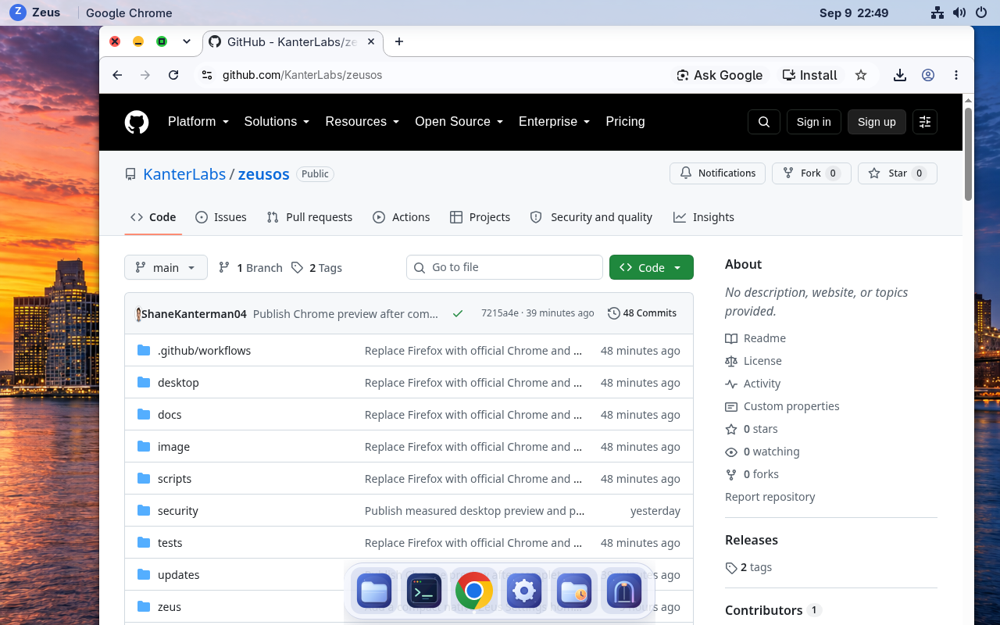
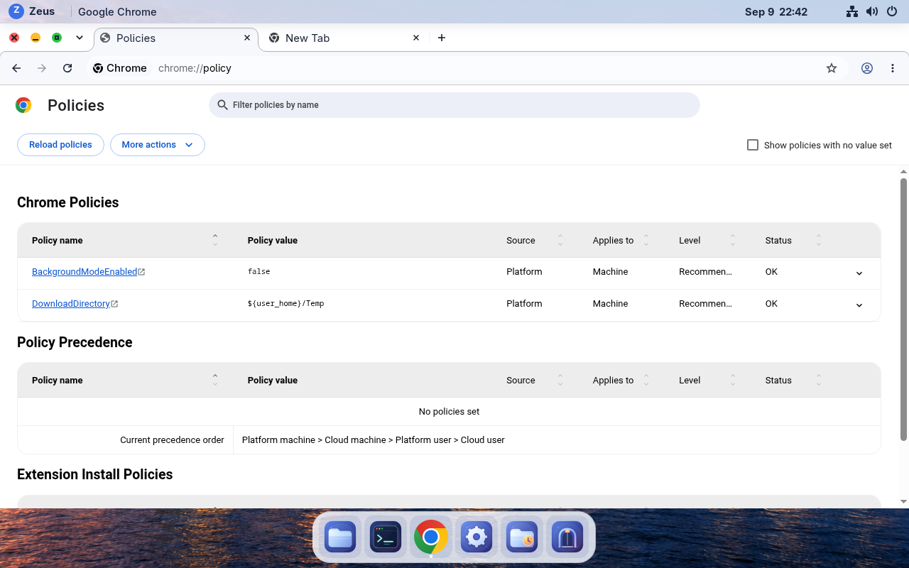
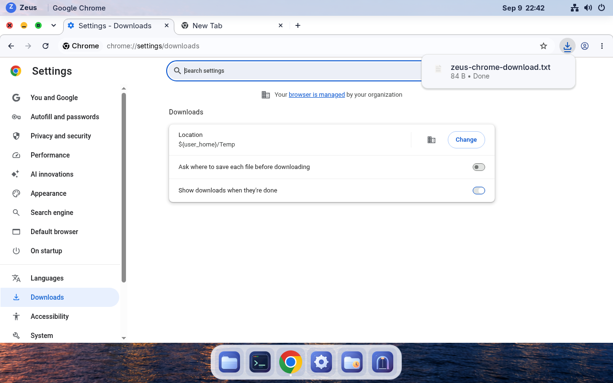

# Chrome default — September 9, 2026

VM **115** runs **0.1.0-preview.2**, build **git-9c2cfbdcb703**. Official Google
Chrome Stable **153.0.8010.36** replaces Firefox, appears in the dock, and handles
HTTP, HTTPS, HTML and XHTML. Existing browser profiles and unrelated defaults
are preserved. New downloads use **Temp**; Chrome background apps default off.
Browser updates arrive through signed Zeus Updates.

## Native verification

The [installed UI record](installed-ui-verification.json) and
[runtime health](runtime-health.json) confirm native Wayland launch, all four
default handlers, successful HTTPS browsing, and the one-time dock migration.
Chrome's policy page reports both recommended preferences **OK**. Its native
download settings retain an editable **Change** button. A real 84-byte attachment
downloaded into `~/Temp` without a destination prompt and matched the
[server checksum](native-download-final.jsonl).

The [sandbox screen](chrome-sandbox.png) reports namespace, PID/network isolation
and seccomp-BPF/TSYNC active and considers the browser adequately sandboxed.
Yama ptrace protection is reported absent; the image still has enforcing SELinux.
The packaged sandbox helper remains intact and no sandbox bypass is supplied.
Chrome's metrics-consent marker is absent.

The [real Chrome Temp fixture](temp-runtime-isolated.json) passed in **3.624 s**:
an active `.crdownload` and sentinel survive an overdue hourly cleanup;
completion matches its hash; **Keep** moves a file into fixture Documents;
later cleanup removes eligible Temp files and retains the kept file. It uses
the installed Temp implementation and active-file inspector, a disposable
profile/home, isolated DBus/display variables and loopback endpoints. Teardown
confirms zero live or zombie fixture group members. No owner deletion test ran.
The earlier [fixture result](temp-runtime.json) is retained; its session-bus
isolation was tightened before the qualifying rerun.

Closing Chrome's last native window left **zero Chrome or crashpad processes**
within the [0.481 s observation](close-background.json), without forced termination.

## Update, preservation and corrections

The [receipt](build-receipt.json), [booted status](bootc-after.json) and
[installed updater status](update-installed.json) identify the exact signed image.
Native Updates, Polkit and the separate restart action installed it on the
populated VM. The previous **git-31f0851a9d07** image is retained. Actual GLib on
that predecessor selected its installed Firefox from an isolated Chrome-first,
Firefox-fallback MIME list ([compatibility](rollback-compatibility.json)). A full
rollback boot cycle was **not** repeated. No reinstall, reseed, disk replacement
or user-data restore occurred.

A fresh populated VM backup passed [zstd and full VMA verification](backup-verification.json).
[Eight owner file hashes](preserved-final.txt), including a file written after
the backup and the existing Temp sample, survived the update and qualification
boots. Temp was held at Never for those boots and [restored to On boot](temp-final.json)
afterward. Appearance/accessibility choices remain unchanged.

Native Chrome exposed an old VM login-keyring password mismatch after the
earlier account password change. The original 105-byte keyring, whose collection
reported no items, was [preserved byte-for-byte](keyring-preservation.json).
Fresh native login created a new encrypted login keyring; it unlocks and stores
Chrome Safe Storage. The [original hash still matches](keyring-final.json).
This was a local VM repair, not an automatic reset for populated laptops.

The signed feed pointer briefly advanced while the OCI upload was still in
progress. It was restored before any installation, then republished only after
[all six uploaded assets](assets-verified.json) matched their sizes and SHA-256.
The [publication correction](publication-order-correction.json) preserves the
sequence. [Other qualification notes](qualification-notes.json) retain the SSH
launch and process-inspection harness corrections.

## Measurements and limits

Source CI passed **159 Python tests**, including **11 browser tests**, plus
**nine lock lifecycle tests** and the Rust/CLI checks. The image validator passed
both during assembly and on the installed VM. The full archive is
**1,925,267,456 bytes**, up **86.840 MiB**; package count is **1,023**, up 12 net.
The [package diff](package-diff.json) also records three SELinux RPM updates
because Fedora repositories are not snapshot pinned. Builder VM116 is stopped.

| Observation | Chrome build | Previous city reference |
| --- | --- | --- |
| Median OS startup, three cold boots | 7.033 s | 6.834 s |
| Median host start to active GDM | 17.681 s | 17.609 s |
| Closed desktop, 120 s idle | 0.150% CPU / 911.3 MiB | 0.150% / 904.7 MiB |
| Chrome open, one static Example Domain tab, 120 s | 0.200% CPU / 1,253.1 MiB | Not measured |

The first cold-start host probe took **46.938 s** despite **7.033 s** OS startup;
its cause remains unconfirmed and the sample is retained. The other host samples
were 17.681 and 17.606 s. Both idle windows had a 20 s settle, 5 s samples and
zero Temp cleanup activations. No guest probes overlapped them. The shared host
was otherwise unisolated. Historical reference and single fresh-profile idle
windows do not establish a controlled Firefox comparison or battery improvement.
See [raw comparison](performance-comparison.json) and [metrics history](../../metrics.md).

The [laptop readiness record](../../laptop-readiness.md) identifies the Nimo
N154G and tracks the remaining physical radio/audio, suspend, battery,
servicing and Fedora migration work. No laptop backup or laptop change occurred.
The no-USB migration has not been rehearsed or executed.
