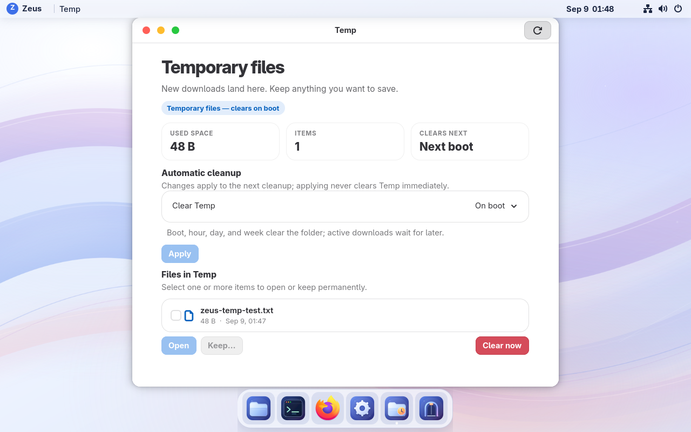

# Temp and compact controls — September 9, 2026

VM 115 runs **0.1.0-preview.2**, build **git-bbd36cc2af2f**. This is an iteration
of the current preview, not a new release number. The [receipt](build-receipt.json)
identifies the exact signed image. The preceding `git-e7f47e75218d` build is
superseded; its immutable artifacts remain historical evidence.

## Implemented

- Native GTK3/GTK4 window controls paint flat 14px red/yellow/green circles,
  with 24px logical minimum click widths and native window actions.
- New standard downloads go into private `~/Temp`. Firefox was tested with
  an actual attachment download. XDG folder defaults, Files bookmarks, the
  dock and Welcome provide access. Existing Downloads contents are untouched;
  existing explicit custom destinations remain owner choices.
- On boot is the default. Hourly, daily, weekly, custom (minimum 15 minutes)
  and Never are available. The app shows usage and when cleanup runs next.
- Keep… moves selected regular files into a chosen permanent folder within
  the owner home, initially Documents. Name conflicts do not overwrite files.
- Clear now asks for confirmation. Deletion is permanent, not a move to Trash.
  An OS update reboot also counts as a boot for the default cleanup policy.
- Cleanup runs as the owner. A socket-activated, read-only inspector reports
  open-file identities for that same UID. Uncertain inspection defers cleanup;
  partial markers defer the whole sweep to protect browser companion files.
- Timers check once per minute. Boot cleanup attempts once per boot; an
  interrupted/deferred boot attempt waits until the next boot. Only captured,
  unchanged candidates are eligible. Symlinks and mount boundaries are skipped.

## Verified

33 repository tests pass, including populated migration, all schedules,
unsupported state, interrupted boots, new files after snapshot, path replacement,
mount boundaries, partial downloads and Keep conflicts. GitHub CI passed the
payload commit on the homelab runner tiers. The installed image passes actual
open-FD, nested cleanup, boot-once, partial-companion, symlink and descriptor-leak
fixtures in temporary test homes; no destructive fixture targets owner folders.

Native desktop checks cover login, light/dark rendering, hourly/custom policy
application, unsaved-edit persistence, Firefox downloads, Keep into Documents,
Clear confirmation/cancel, and native window actions. GTK3/GTK4 parser checks and
24px click-width measurements passed at 100% and XWayland 200% scaling. Full
fractional Wayland/accessibility qualification remains future work. Applications
with custom window chrome, including Firefox, can retain their own buttons.

All six recorded permanent-file hashes survived the final update and reboot,
including the existing Downloads sentinel and the file saved with Keep. A second
Firefox test download survived a same-boot service restart and is left in Temp
for review. The permanent saved copy is in Documents.

The populated backup
`/mnt/pve/sata-ssd/dump/vzdump-qemu-115-2026_09_08-15_51_51.vma.zst`
passed zstd and VMA integrity checks. No restore, reinstall or disk replacement
was used. Secure Boot and SELinux remain enabled; no system units are failed.
The rollback slot contains the preceding Temp build and uses the same state
schema. This iteration did not perform a rollback/re-forward or backup restore.
Encrypted-home ordering, sandboxed third-party download apps, physical laptops
and full hostile concurrent-filesystem stress are not qualified by this preview.

The archive, checksum and signature are retained locally, on the Proxmox artifact
store and as uniquely named assets of the existing `v0.1.0-preview.2` prerelease.
Local, guest and Proxmox verification passed; GitHub's archive digest matches.
