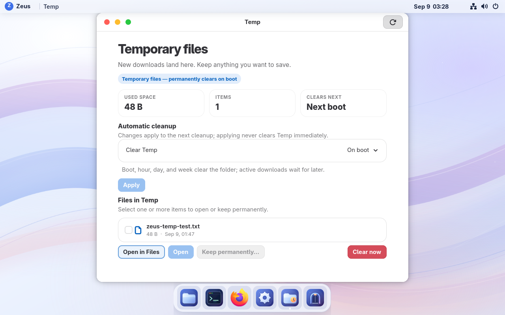

# Desktop, Temp and power — September 9, 2026

The review VM runs **0.1.0-preview.2**, build **git-de0d8baae5de**. The
[receipt](build-receipt.json) identifies the signed image. The product version
stays fixed while we refine this preview.



## What changed

- Temp explains permanent deletion and update reboots on first use, remembers
  acknowledgement separately from the cleanup policy, and offers Open in Files.
  Files and file chooser bookmarks retain existing destinations and labels.
  Keep permanently… continues to move selected files into permanent storage.
- Super+E opens Files and Super+Shift+T opens Temp. Super+Space searches apps.
  Search caches installed applications until they change, and the shell follows
  the system animation preference. Dock and panel discovery uses signals.
- The Temp window replaces four-second full scans with bounded file monitors.
  Refresh work is debounced and deferred while hidden. Deep changes inside an
  existing subdirectory can require the Refresh button.
- On boot and Never leave the cleanup timer inactive. Timed modes arm the actual
  next deadline and collapse missed deadlines into one catch-up attempt. Settings
  and sweeps synchronize scheduling; uncertain inspection backs off. Background
  scheduling reads metadata without walking Temp or logging its filenames.
- Balanced and Power Saver integrate with GNOME. Defaults dim and blank an idle
  display, suspend after ten minutes idle on battery, and request Power Saver at
  low battery. Personal settings take precedence. Compressed RAM swap helps
  under memory pressure. These features need physical-laptop qualification for
  battery savings and suspend reliability.
- The image compiles its hardware database at build time, disables the unused
  NFS client startup target, and omits 18 optional foreign-architecture emulator
  packages. Native applications, laptop drivers, Secure Boot, SELinux, the QEMU
  guest agent and recovery entries remain available.

## Measured performance

The [performance report](../../performance/boot-power-20260909.md) publishes every
boot sample and the matched idle and launch measurements, including limitations.
The Proxmox VM has no battery or physical power-profile driver. No battery-runtime
or wattage improvement is claimed; the [battery test protocol](../../performance/battery-test-protocol.md)
and read-only measurement harness are ready for a real laptop.

## Qualification

73 repository Python tests pass, including scheduling, atomic policy changes,
active-file protection, monitor lifecycle, bookmark preservation, desktop
configuration and battery-unit calculations. Installed GNOME validation accepts
82 settings, and both GTK theme parsers pass. Source CI uses the homelab runner
tiers. Native console checks and installed runtime results are in the receipt.

The disposable runtime fixtures use the actual Temp backend and root inspector
for boot-once behavior, active open files, partial-download companions, nested
cleanup, symlink targets, existing Downloads, Keep conflicts and descriptor
stability. A second harness creates uniquely named, real user-systemd units to
check deadline firing/rearming, overdue catch-up, Boot/Never disarming,
cancellation and failure without a rapid loop. It cleans only its own fixtures.
Its shortened deadlines and `Persistent=false` isolate the test from owner
timestamp state; it does not qualify persistent systemd replay across shutdown.

Run those fixtures on the installed preview as the owner:

```sh
python3 scripts/validate-temp-runtime.py
python3 scripts/validate-temp-scheduler-runtime.py
```

Six recorded permanent-file hashes and the existing Temp sample are checked
through the update. Temp is held at Never for qualification reboots, then restored
through the policy API. Switching back to On boot marks the current boot so a
same-boot service restart cannot wipe newly retained files. The next OS boot is
eligible for the normal configured cleanup.

The populated pre-upgrade backup passed both zstd and decompressed VMA validation.
No backup restore, reinstall or disk replacement is used. The final rollback slot
contains `git-08c7e89dd3b9`, with the same Temp backend. Populated fixture checks
also prove schema-1 read/write compatibility with the older `git-bbd36cc2af2f`
binary, including the new On boot deferral. No VM rollback/re-forward cycle was
performed in this iteration.

The uniquely named OCI archive, signed checksum and metadata belong to the
existing `v0.1.0-preview.2` prerelease. Historical artifacts are preserved. This is
an update for the existing installation; a new installer or disk image was not
built. Full physical battery, GPU, fractional-scaling, accessibility, encrypted
home and third-party sandbox qualification remains separate work.
