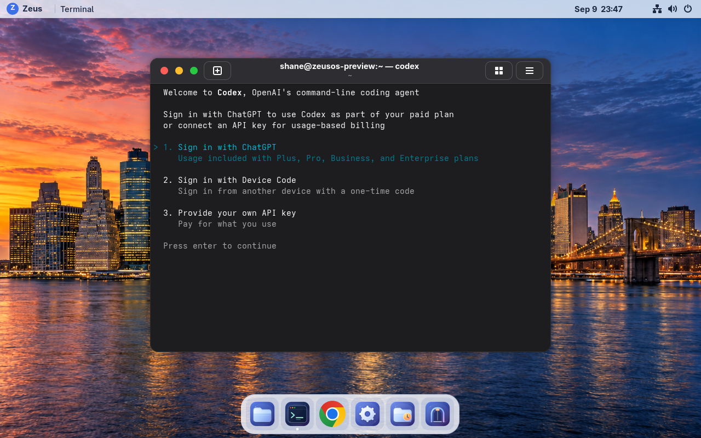

# Codex CLI preview — 2026-09-09 UTC

VM **115** runs **0.1.0-preview.2 / git-f080c2d9bc53**, with official standalone
**Codex CLI 0.154.0**. Open Terminal in a project and run `codex`, then use your
own sign-in. This command runs locally. The remote T3/Codex launcher remains
separate work.

The [build receipt](build-receipt.json) records the signed image and installed
checks. Its booted manifest is
`sha256:8797860dc4c27c7e8e3f0034bfcf71f9876401df809509c6b49588752c9c1c18`.
The [source build](https://github.com/KanterLabs/zeusos/commit/f080c2d9bc53fc8d8666c6fd8512225cd5e0de48)
keeps the same product version. The previous Chrome build `git-9c2cfbdcb703`
remains retained for rollback.

## Verified behavior

- The pinned full package and all six installed files match their hashes.
  The matching execution host, sandbox, ripgrep and shell helpers keep their
  upstream layout. [Provenance](codex-provenance.json) distinguishes the official
  archive checksum check from an upstream signature verification, which was not
  performed. Zeus signs the resulting image and update metadata.
- [Installed-image checks](image-contract.json) confirm no Node/npm, owner home,
  root Codex state, or Codex system/user service. Version and main/sandbox/login
  help work without authentication. [Installed CLI evidence](installed-codex.json)
  includes the version command after integrity checking; its 0.007 s observation
  is warm and does not measure a cold interactive launch.
- [Real sandbox checks](sandbox-runtime.json) allow a project write, deny an
  outside write and host-network access, and deny writes in the read-only
  profile. These run as the normal desktop user using disposable files.
- [Native Terminal qualification](codex-lifecycle.json) reached the sign-in
  choices and exited with no Codex process remaining, observed after 0.522 s.
  No account sign-in or model/API request was performed. No Codex process started
  at [fresh login](processes-after-login.json).
- Startup update checks default off through the supported system configuration.
  Personal configuration takes precedence and is never replaced by packaging.
  Codex upgrades arrive through signed Zeus Updates.

## Deployment and preservation

All [six immutable release assets](publication.json) passed size/digest checks
and the checksum/feed signatures were verified before the latest feed advanced.
The Zeus updater installed the image through its administrator CLI; an explicit
reboot applied it. [Timing](install-timing.json) records 23.416 s from the restart
request to SSH observing the new build. This iteration did not repeat the prior
graphical updater/Polkit qualification.

The populated VM [backup](backup-verification.json) passed zstd integrity and
full VMA verification. No restore, reinstall, seed replacement or disk replacement
was performed. [Twelve stable file hashes](preservation-final.json), including
both existing keyrings, Temp files, permanent files and a post-backup marker,
match after all qualification boots.

The early Chrome Preferences hash differs. Its recorded modification time,
23:19:10 UTC, predates the image build and update. It is identified separately in
the [preservation assessment](preservation-assessment.json), rather than counted
as an exact hash match. The existing profile opened without first-run or keyring
prompts, its keyring was unlocked, and [HTTPS browsing worked](chrome-profile.png).
No profile was restored or rewritten by deployment.

The [retained-image check](retained-compatibility.json) compares unchanged Zeus
binaries and the identical RPM inventory, then runs the retained Temp module
against populated owner state. A full rollback boot cycle was not run.
[Temp is restored to On boot](temp-final.json), after being held at Never for
qualification boots. [Runtime health](runtime-health.json) confirms Chrome as
the HTTPS default, Secure Boot enabled, SELinux enforcing and no failed system
or user units. Builder VM116 is stopped.

## Measurements

Same VM: 4 vCPU, 8 GiB RAM, 64 GiB disk, 1280×800 display at 100% scale.
The builder was stopped and backup verification finished before sampling.

| Measurement | Chrome reference | Codex build |
| --- | ---: | ---: |
| OS startup median | 7.033 s | 7.515 s |
| VM start → active greeter median | 17.681 s | 18.305 s |
| Closed desktop idle CPU | 0.15% | 0.20% |
| Closed desktop used memory | 911.3 MiB | 919.6 MiB |
| Full OCI download | 1,925,267,456 bytes | 2,060,534,272 bytes |
| RPM packages | 1,023 | 1,023, identical inventory |

[All samples and conditions](performance.json) are retained. Three OS startup
samples were 7.769, 7.141 and 7.515 s; host-to-greeter samples were 20.264, 18.305
and 17.778 s. Closed idle uses a 20 s settle and 120 s sample at 5 s intervals.
The standalone package occupies 339,126,741 bytes; the compressed image grows
129.000 MiB. No new boot service was added.

Boot medians are higher than the earlier shared-host reference. These small
samples do not establish the cause of the difference or measure battery life.
Physical laptop, AirPods and Fedora migration qualification remain separate.

165 Python tests, including six package tests, nine lock lifecycle tests, Rust
format/build checks and source/feed CI passed:
[source CI](source-ci.json), [feed CI](feed-ci-final.json).
Hark Live Activity publication timed out repeatedly; Helm tracking remained
available under ZOS-77.
