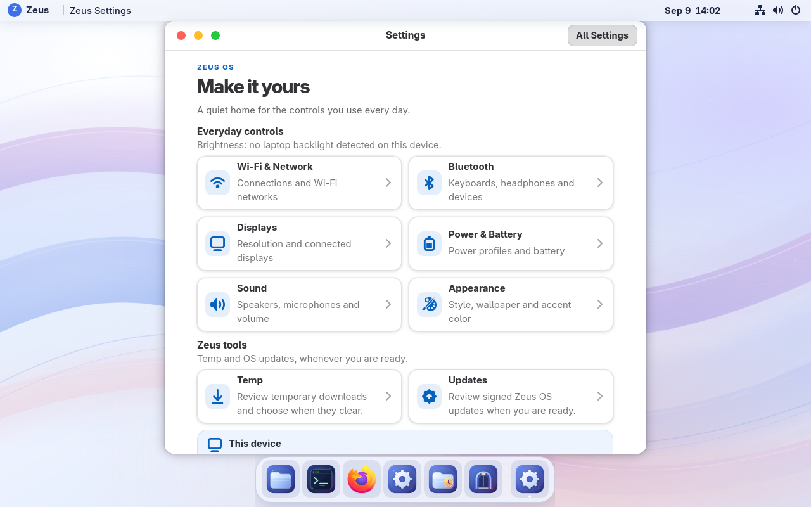
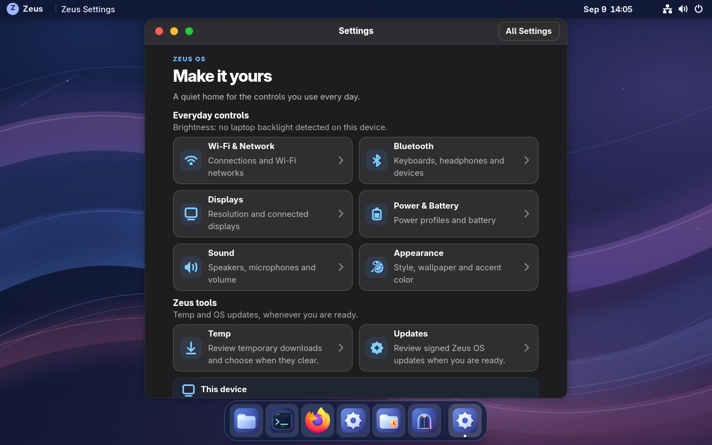
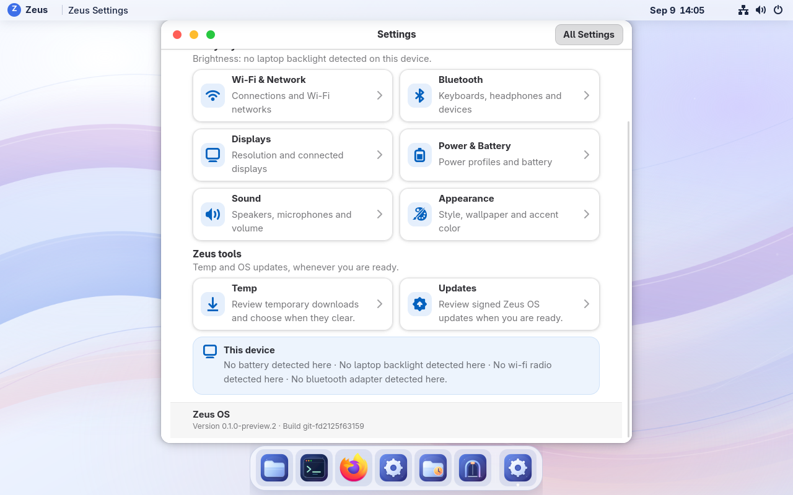
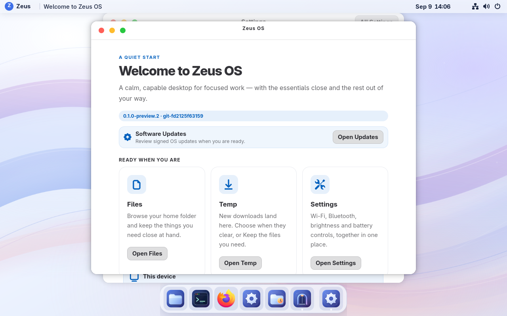

# Everyday laptop Settings — September 9, 2026

VM 115 runs **0.1.0-preview.2**, build **git-fd2125f63159**. Open
**Zeus → Settings**, **Welcome → Open Settings**, or search for **Zeus Settings**.
The [receipt](build-receipt.json) identifies the exact image and verification.

## Everyday controls

The compact native window groups Wi-Fi/network, Bluetooth, displays, power and
battery, sound, appearance, Temp and Updates. It opens GNOME's existing controls
with native activation and focus behavior. **All Settings** opens the complete
control center. Local version/build and hardware availability appear below the
action cards.

Brightness uses the existing top-right system-menu slider on supported laptops;
the window explains where to find it. VM 115 has Ethernet and native display and
power settings, but no physical Wi-Fi adapter, Bluetooth adapter, backlight or
battery. The window reports those limits without invented readings. Radio
pairing, physical brightness, suspend/resume and battery life remain hardware
qualification work.

Opening Settings performs bounded local reads. There is no new package, daemon,
timer, network check or periodic status refresh. Opening its Updates destination
explicitly starts the existing updater app and its normal check-on-open behavior.
The [feature contract](../../features/laptop-settings.md) records these boundaries.

## Signed update and preservation

The existing native Updates app installed the signed archive, then its separate
restart action applied it. [Staged status](staged-bootc.json) identifies the signed
candidate while the previous build was running. [Booted status](booted-bootc.json)
identifies this build and retains **git-17d205103f3a** for rollback. No automatic
reboot, reinstall, owner-account reseed, disk replacement or backup restore was
used. The product version remains unchanged.

Both detached signatures and all six uploaded release assets were verified.
[Public feed verification](public-feed-verification.json) records that the public
manifest/signature pair matched the local verified files. The native updater
independently verified the signed selection and downloaded archive before staging.
Private signing material stayed off the builder and image.

A fresh populated backup passed zstd and full decompressed VMA verification before
the update; see [backup verification](backup-verification.json). Six permanent
test files and the existing 48-byte Temp sample were checked by hash. Temp was
temporarily held at Never during qualification boots and restored to On boot
afterward. [Final hash checks](preserved-final.txt), [restored Temp
state](temp-final.json) and [final preference comparison](preference-comparison-final.json)
record the outcome. The Settings-only isolation test preserved the full GNOME preference
dump, Temp state and existing update deployment state. Broader native-panel tests
changed a GNOME night-light default; that exact unset state and other test-only
preferences were restored, as recorded in [preference restoration](preference-restoration.json).

No new mutable Settings schema was introduced. The predecessor uses the same
Temp and updater backends. No VM rollback/re-forward cycle was run this iteration.

## Qualification

[Source CI](payload-ci.json) passed all **136 Python tests**, including 13 Settings
tests, plus Rust formatting, compilation and CLI contracts. [Installed-image
checks](image-validation.log) validated 82 GNOME settings, GTK3/GTK4 themes,
Settings imports and styling, the desktop entry/icon, launcher permissions,
native panel destinations and final build identity. An unpublished first build
exposed a builder-umask permissions mismatch; explicit installed modes corrected
it before the signed candidate was published.

Native source qualification exercised all six GNOME panels, Temp and Updates,
repeated activation, keyboard navigation, safe desktop fallback and light/dark
styling at 100% and 200%. Installed entry points and final screenshots were
checked again after updating the VM; see [installed UI verification](installed-ui-verification.json).
Existing GNOME controls remain responsible
for applying hardware settings.

The [image cost record](image-cost.json) shows **1,011 unchanged packages** and an
archive increase of **75,264 bytes (73.5 KiB)**. This is a full OCI preview update
for the existing VM; no new installer image was produced.

The [timestamped metrics history](../../metrics.md) retains all baseline and final
boot/idle samples, measurement conditions and limitations. Median OS startup
was **7.901 s**, compared with **7.343 s** before this change; host-start-to-active
greeter was **20.276 s**, compared with **18.708 s**. The slower third run remains
in the record. Closed idle was **0.150% CPU / 954.2 MiB**, compared with
**0.125% / 957.1 MiB** before. Settings-open idle was **0.125% / 1,021.3 MiB**.
No declared review threshold was exceeded; these samples do not establish a
speedup or physical battery result. [Runtime health](runtime-health.json)
confirms enforcing SELinux, Secure Boot and zero failed system/user units.

## Screenshots

