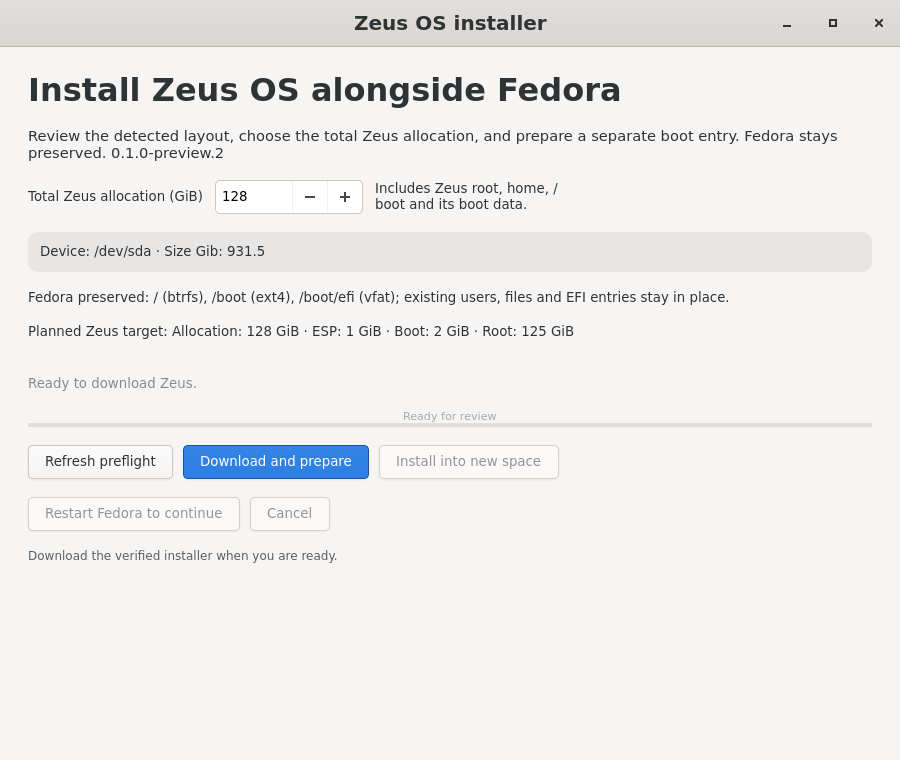
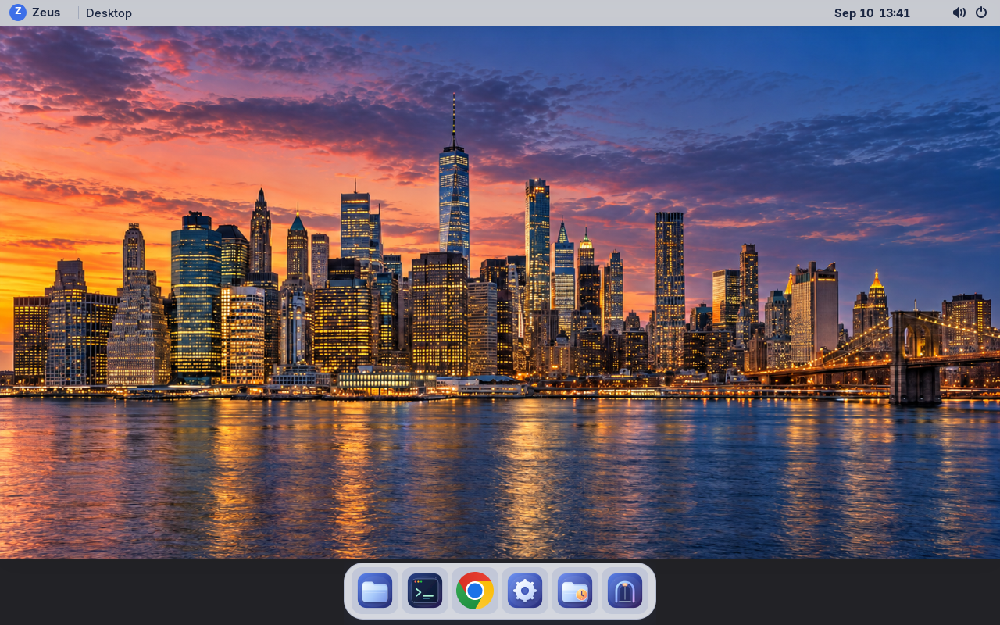

# Fedora dual-boot installer qualification — 2026-09-10

The first Fedora-launched installer adds Zeus alongside Fedora, with a separate
Zeus root/home, `/boot` and EFI partition. The default allocation is 128 GiB
total. Fedora keeps its files, account and default boot choice. Installation
uses two phases with a Fedora reboot between them, followed by a startup menu
offering both operating systems. No USB or firmware-menu interaction was needed
in the disposable VM tests.

Product version remains **0.1.0-preview.2**. Installer RPM builds carry their
own Git revision in `BUILD-INFO`; the installed OS is the already released
**git-f080c2d9bc53** image. Its OCI archive is 2,060,534,272 bytes with SHA-256
`5c6009b852caf7b2fa2285a7385f1819b98081502dc6e42636e582bfa493bcfd`.
Signed metadata is pinned to a fixed Git commit so later preview-feed changes
cannot change the image selected by this installer.

## Accepted evidence

| Check | Result and evidence |
| --- | --- |
| Verified pre-change backup and restore | The 4,888,563,990-byte Fedora VMA passed `vma verify`, was independently copied and hashed, then restored to empty VM118. All 16 baseline files and the complete GPT matched. [Backup](vm117-backup-verification.json), [restored baseline](vm118-baseline.json), [additional preinstall configuration backup](vm118-preinstall-proof.json). |
| Clean installation | VM118 completed shrink, partition-end change, Fedora reboot, isolated Zeus installation and default Fedora boot without manual storage repair. All 16 original files, totaling 712,474,577 bytes, retained their hashes, including Fedora EFI/BLS and second-disk sentinels. Original partition starts and GUIDs remained unchanged. [Installation receipt](vm118-installation.json). |
| Offline boots and login | Fedora and Zeus each booted twice with the VM network disconnected. Zeus accepted the configured `shane` login; its home was separate, its EFI update service succeeded, and no systemd units were failed. Chrome 153.0.8010.36 and Codex 0.154.0 were present. |
| Fedora kernel and bootloader servicing | A real Fedora update installed kernel 7.2.4-100.fc43 and GRUB 2.12-43.fc43. Both systems booted afterward. All nine Zeus EFI files and the six-partition GPT were unchanged by Fedora's update. [EFI preservation receipt](vm118-fedora-update-efi-proof.json). |
| Zeus update and retained rollback | VM117 booted a marker-only synthetic candidate through the existing updater command, then booted the retained original deployment. Independently backed-up user/config files survived both transitions; Fedora ESP/boot/BLS hashes and the Zeus ESP identity remained intact. [Receipt](vm117-update-rollback.json), [rehearsal script](vm117-update-rollback.sh). |
| Menu-only removal | The real installed Fedora journal selected only the owned Zeus menu script. Cancellation and repeated removal were harmless. The exact script and generated configuration were re-enabled afterward; Fedora defaults/grubenv, data sentinels and all partition identities remained unchanged. [Receipt](vm118-menu-removal.json), [rehearsal script](vm118-menu-removal.sh). |
| Scoped EFI writes | Separate initial-install and ongoing-update probes restricted writes to the mounted Zeus ESP and preserved the earlier Fedora ESP. The ongoing probe used a synthetic byte/metadata mutation; it does not qualify a released shim update's bootability. [Contract and limits](efi-update-contract.md). |

The disposable VMs used 4 CPUs, 8 GiB RAM, UEFI with Secure Boot disabled, a
931.5 GiB target disk, Fedora 43 Btrfs root/home and a separate sentinel disk.
VM115, the normal Zeus desktop preview, was not an installer target.

## Screenshots

The native GTK installer below renders the supported VM layout using a test
facade. It demonstrates the review screen; it is not a captured physical-laptop
installation or a test of Fedora's graphical authorization prompt.

This desktop capture is from the real VM118 offline boot after installation:

## Failure handling and limits

Automated tests cover invalid signatures and archives, changed target identities,
unsupported layouts, low space/power, protected journals, and injected failures
around storage writes. Interrupted mutations leave a durable ambiguous-state
marker and are refused on retry; they are not blindly replayed. This does not
claim power-loss atomicity or a physical power-cut test at every write boundary.

The earlier VM117 development run exposed an unsupported sfdisk option and a
GRUB regeneration side effect. Those were fixed before the clean VM118 run;
VM117's inspected manual repair is excluded from clean-install evidence.
VM118's first offline boot also logged recoverable hostname warnings. The final
seed writes `/etc/hostname` first and preserves it; the installed cloud-init
schema accepted the revision and a subsequent Zeus boot used that hostname.
There was no second full clean install solely for this seed adjustment.

This is a **VM-tested preview**, not physical Nimo N154G qualification. It does
not reproduce the laptop's reported 328 GB occupancy or establish Wi-Fi,
AirPods, trackpad, battery, suspend, firmware or physical recovery results.
The exact supported layout and verified-backup receipt requirement are in the
[installer guide](../../../installer/README.md). No laptop partitions have
been changed.

The tested removal scope is the owned boot-menu entry. A graphical uninstaller
and automatic partition-space reclamation are separate work. User data is
never discarded as part of an OS update or rollback.

Installation timings and conditions are appended to the
[metrics history](../../metrics.md). Build artifacts are distributed with the
existing preview release; no product-version increment is needed for this
installer iteration.
