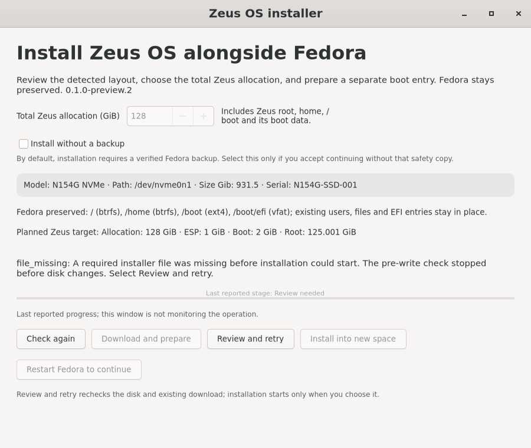
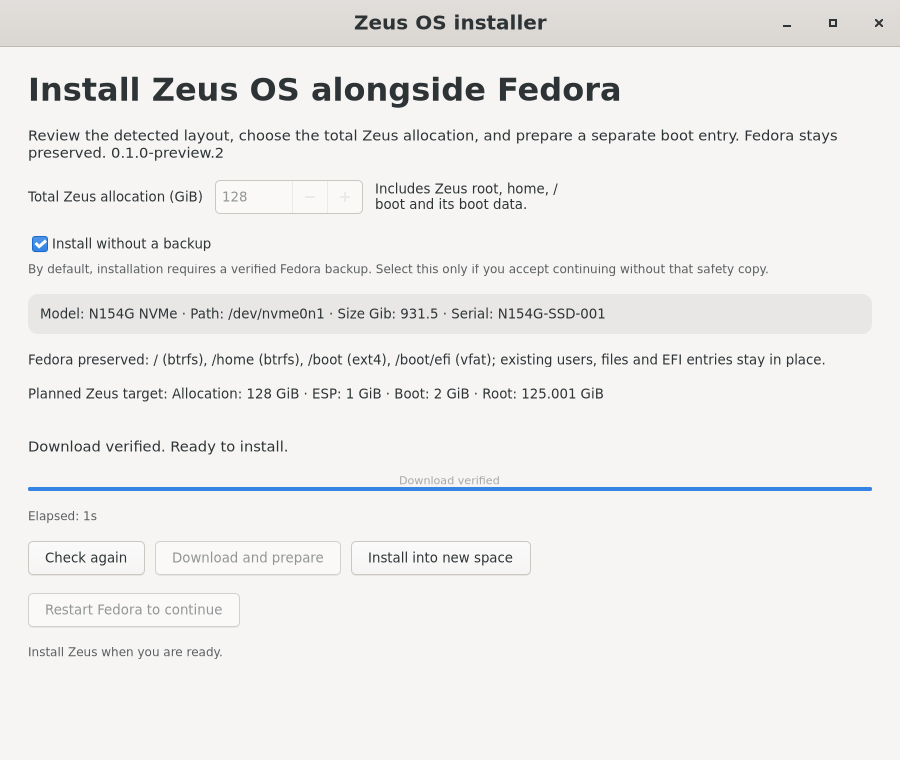

# Owner backup choice and recovery before disk writes

Product version remains `0.1.0-preview.2`. The previous installer incorrectly
made an agent workflow requirement mandatory product behavior and hid a
missing backup receipt behind a generic maintenance error. The reported
journal reached `prepared`, then `installing` and `error: file_missing`, with
no executor state. The receipt read occurs before the durable state required
for any filesystem resize.

The desktop offers **Install without a backup**, unchecked by default. The
owner's explicit selection is forwarded through the fixed authenticated
helper and recorded honestly against the journal's target. It never creates
a receipt claiming a backup was verified. The ordinary verified-backup route
remains available. Filesystem geometry, artifact trust, AC power, resource,
qualification, reboot-boundary and EFI ownership checks remain in force.

**Review and retry** is limited to the known failure before executor writes.
It checks the original plan and full disk table against fresh inventory and
reverifies the existing archive before restoring the same journal to
`prepared`. The action preserves the operation history and downloaded file;
it does not automatically install or restart. Executor state, changed disks,
invalid archives or ambiguous history prevent recovery. Error screens do not
reuse the completed download percentage as installation progress.

Agent-run tests retain independently verified backups of the disposable
Fedora VM. That testing discipline is separate from the product choice. The
physical laptop is not modified by the agent, and successful tests do not
claim physical hardware qualification.

Build-specific verification, exact-commit CI, the native UI journey and
isolated replay results are included in the signed release verification
receipt. The replay uses the owner-provided journal in temporary storage,
the actual signed archive, and injected original disk inventory; no disk
write commands run. Raw owner diagnostics are not published.

## Validation

- Parent-run installer suite: 169 tests passed in 12.719 seconds.
- Native GTK success and refused-recovery journeys stayed responsive and
  passed; installation required the explicit checkbox selection and a click.
- The actual signed archive and reported legacy journal recovered successfully
  in isolated Fedora staging. Changed disks and executor markers were refused.
- Populated Fedora VM package upgrade and exact-commit CI results are recorded
  in the build-specific signed receipt after packaging.

