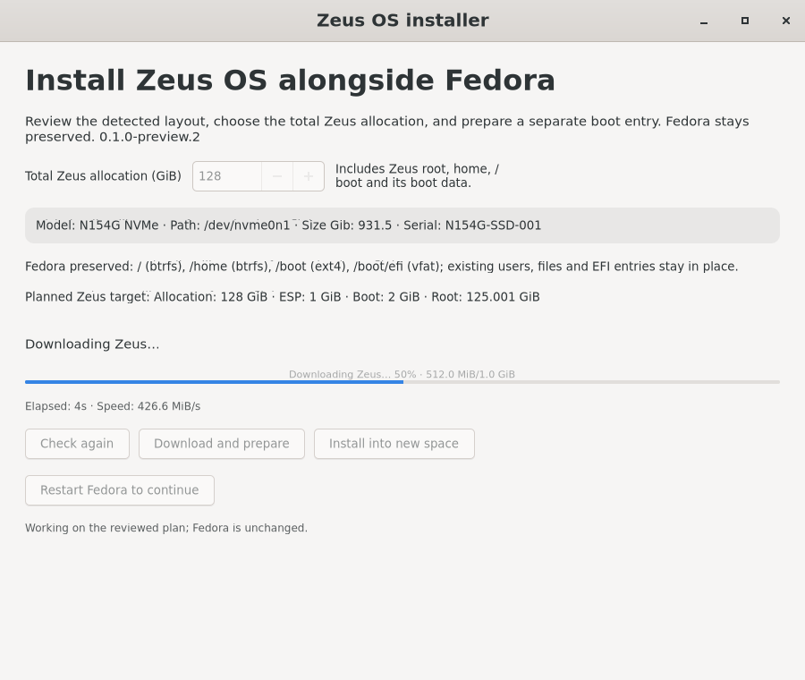
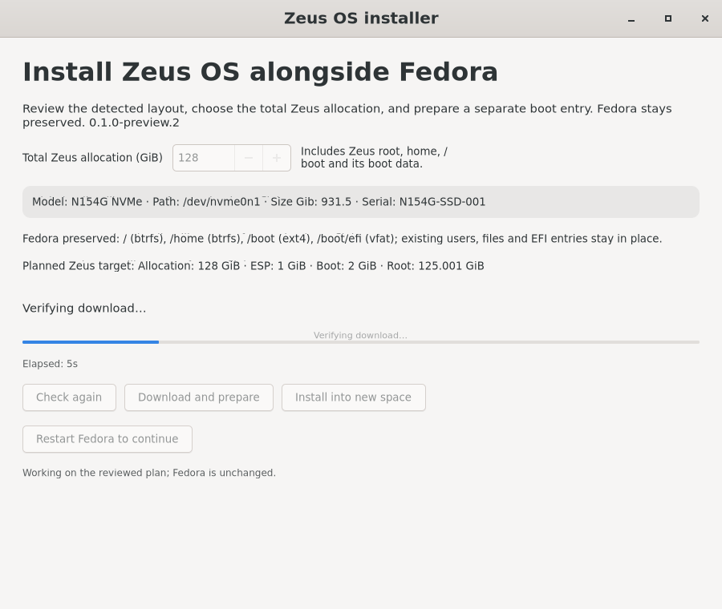

# Installer preparation feedback

This iteration keeps product version `0.1.0-preview.2` and the existing OS
image. It addresses the reported wait after **Download and prepare**: several
password prompts appeared while the window continued to say it was rechecking
the target. The owner subsequently confirmed download progress, so the report
does not establish a deadlock.

The desktop review uses one privileged request to inspect the existing
operation and, when idle, collect the Fedora layout. Starting preparation uses
the already reviewed allocation and fingerprint. The privileged helper still
collects the current layout and rejects a changed target before downloading.
This removes duplicate desktop checks without trusting stale disk information.

Preparation reports named stages for checking the target, waiting for another
operation, fetching release metadata, connecting, downloading and verifying.
Byte progress remains distinct from the final verified result. Checks and
verification use an activity indicator instead of an invented percentage.
Elapsed time and current-stage messages keep delayed work visible; timers run
only while the window is doing work.

The helper's stage events are bounded advisory messages. They do not alter the
journal format, artifact trust, install qualification, backup receipt, or
partition-write rules. Installation keeps its existing execution transport;
an animated activity indicator does not claim a measured installation percent.
Existing operation snapshots are labeled as last reported status, without
repeated privileged polling.

An in-progress laptop operation should finish before installing and reopening
an updated RPM. Updating the launcher is separate from retrying or restarting
an installation.

Validation results and the signed build receipt are recorded with the
published installer assets. The native UI journeys use deliberately delayed
test backends; they exercise feedback and responsiveness, not a physical laptop
installation or real authorization dialogs.

Parent verification: **149 installer tests passed** (7.124 seconds), including
three controller-to-root-helper round trips that retain both root target
checks while reducing desktop/helper requests from five to two. A simulated
30-minute stream retains late byte updates and its verification stage inside
the existing output bounds.

The native GTK delayed success and error journeys verify responsiveness,
installation availability only after successful verification, timer shutdown,
and rejection of late progress after completion and window closure. These
screenshots contain fixture disk and download values:

The build-specific signed receipt accompanies the RPM in the existing release.
It records exact-commit CI results, anonymous artifact checksum/signature
verification, and the Fedora 43 test-VM upgrade. That upgrade compares all 14
previously copied boot/configuration/journal files and the full GPT table;
there is no journal migration or physical laptop operation.
