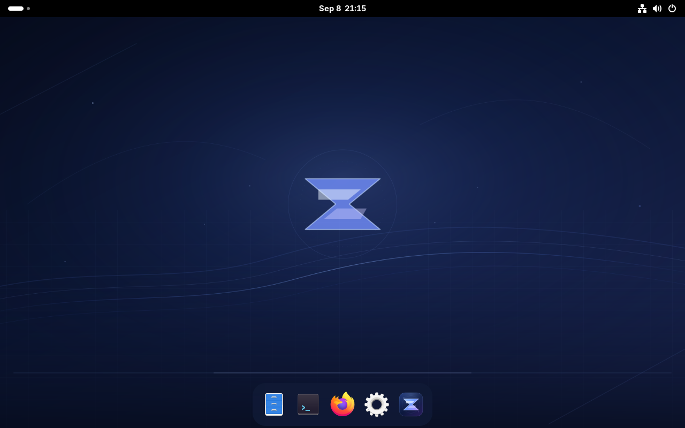

# Zeus OS 0.1.0-preview.1

The first desktop preview brings the Zeus layout to a real Fedora bootc installation: original artwork, a floating bottom dock, native GNOME login and lock, Firefox, Files, Ptyxis, Settings and a native Welcome window. This is the desktop milestone described in the [preview strategy](../preview-strategy.md).

## Build and verification

Deployed and verified on VM 115 on September 8, 2026. Source: `38bb7fc53002a76dbfa4a5c891c3d1b1bbdb4f20`. The [build receipt](preview-1/build-receipt.json), [package inventory](preview-1/packages.lock), and signed [checksums](preview-1/SHA256SUMS) identify the exact artifacts. See the [VM runbook](../preview-vm.md) for operation.



| Check | Observed result |
| --- | --- |
| Cold VM start to visible native login | 21.83 seconds |
| Kernel + initrd + systemd userspace boot | 7.774 seconds; excludes firmware |
| Zeus settled idle | 908.1 MiB RAM; 0.188% aggregate CPU median |
| Standard GNOME presentation on same package set | 882.1 MiB RAM; 0.187% aggregate CPU median |
| Presentation overhead in this sample | 26 MiB RAM; CPU difference below useful significance |
| Native login, lock and unlock | Passed through the Proxmox console |
| Welcome, Files, Settings, Ptyxis, Firefox | Rendered and usable; Firefox loaded the repository over HTTPS |
| Keyboard | Super+Space search, Super+Return terminal, typed commands and Ctrl+C verified |
| Optional dock fallback/restore | Passed; GNOME and Terminal remain usable; owner files retained |
| System security | Secure Boot enabled, SELinux enforcing, no failed system units; SSH root/password login disabled |
| Build checks | 15 contract tests; 68 installed GNOME settings and all dock launcher IDs validated; homelab CI passed |
| Update preservation | Three files and a user preference survived update, rollback and roll-forward; no backup restore performed |

Measurements follow the [declared protocol](preview-1-budgets.md): 60 seconds settling, then five 4-second samples. Raw [Zeus](preview-1/idle-zeus.json), [baseline](preview-1/idle-baseline.json) and [cold-boot](preview-1/cold-boot.json) records are included. RAM is `MemTotal - MemAvailable`; CPU is aggregate guest CPU, not a single core.

This was one 4-vCPU/8-GiB VM at 1280×800 with VirtIO software rendering (`kms_swrast`) on a shared host. The baseline reset 20 presentation settings to installed GNOME schema defaults and restarted the session, with the same package set and a solid background; it was not a separate Fedora Workstation install. Exact owner overrides were restored afterward. Boot and idle targets passed in this sample. Interaction actions passed functionally; precise launch latency and compositor frame/redraw tracing remain unmeasured.

The base image and disk builder are pinned by digest in [inputs.json](../../image/inputs.json). Signed Fedora RPMs are resolved at build time; the published package inventory records the exact result. The build embeds its source revision under `/usr/share/zeus/source-commit`.

Release checksums use an SSH signature with namespace `zeusos-release`. The independently stored public key is in [allowed_signers](../../security/allowed_signers); its fingerprint is `SHA256:iEM0OwJkWgbAptJL/KKFuvg9bGJASyLnPyEj/hwygqk`. Verify the signature, then verify the named files:

```sh
ssh-keygen -Y verify -f security/allowed_signers -I zeusos-preview \
  -n zeusos-release -s docs/releases/preview-1/SHA256SUMS.sig \
  < docs/releases/preview-1/SHA256SUMS
# From the directory containing the downloaded artifacts:
sha256sum -c /path/to/SHA256SUMS
```

This detached checksum signature is an operator verification step. It is not a bootc-enforced signed registry policy. The preview uses explicit, manually staged image updates; unattended update application is disabled.

## Scope and limits

- This is a usable desktop preview, not the complete stable Zeus OS roadmap. Full fractional-scaling and accessibility qualification remain open.
- The VM uses virtual graphics. Laptop GPU acceleration, battery life, suspend, touchpad gestures, Wi-Fi and audio hardware still need physical-device testing.
- Remote profile restoration, full T3 integration, an encrypted interactive installer, and a managed signed update channel remain future work.
- Generic artifacts contain no owner login credentials. Owner provisioning uses a private per-VM seed, kept outside Git.
- Keep the populated review VM. Test destructive installation and recovery on separate disposable guests.

The generic QCOW2 and OCI archive are available as prerelease assets. The QCOW2 is for fresh, disposable installations; update the populated review VM using the verified OCI workflow. Both use the same release source and contain no owner password or SSH key.
