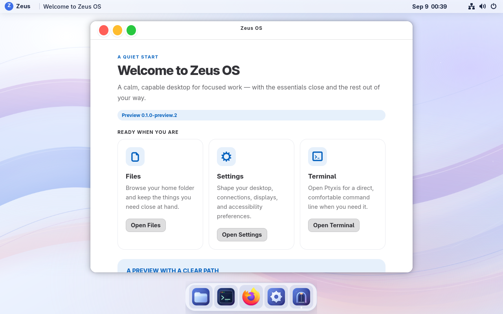
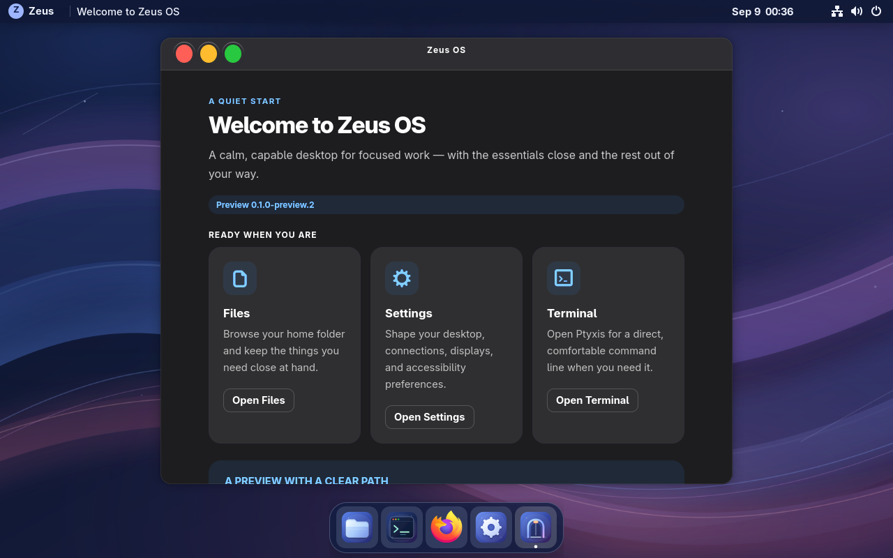
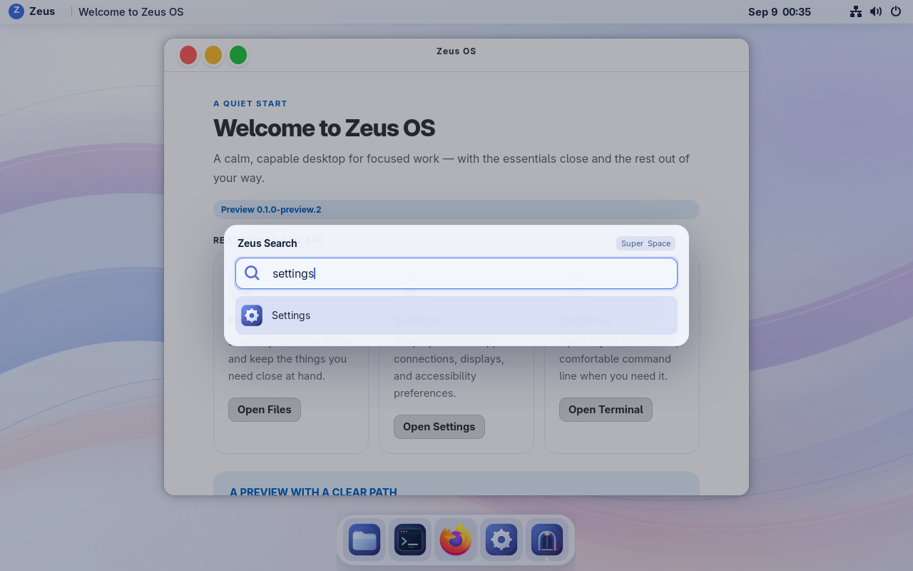
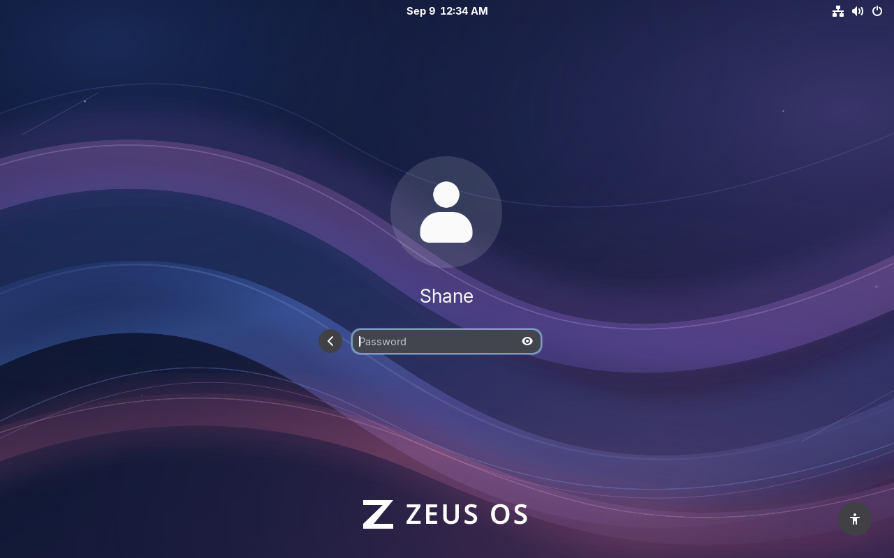

# Zeus OS 0.1.0-preview.2 — desktop visual revision

This revision implements the macOS-inspired presentation requested after review of Preview 1.

| Requested change | Implementation | Runtime result |
| --- | --- | --- |
| Translucent top bar and floating dock | Optional Zeus shell extension; native status/calendar controls retained | Passed on VM 115 |
| Consistent icons and traffic-light controls | Original Zeus icon theme; managed GTK3/4 stylesheet | Passed on VM 115 |
| Softer windows and typography | Rounded native controls, calmer surfaces and spacing | Passed on VM 115 |
| Spotlight-style search | Compact shell dialog with application search and keyboard selection | Passed on VM 115 |
| Cohesive wallpaper and login | Original light/dark landscape SVGs; native GDM CSS and wordmark | Passed on VM 115 |
| Light and dark appearance | System color-scheme integration across shell, apps and wallpaper | Passed on VM 115 |

Owner CSS outside the managed import remains intact. The safe-desktop command disables the optional shell and dock, removes managed CSS imports and persists that choice across login. Native authentication and personal data remain independent of the presentation layer.

The populated backup preceding deployment passed zstd and VMA integrity checks. Files written after the backup are included in preservation testing; no backup restore is part of normal updating.

## Try the preview

On the trusted LAN, open Proxmox at `https://10.0.0.20:8006`, select VM **115** (`zeusos-preview`), then **Console**. The native user is `shane`; use the owner-requested preview password.

- Press **Super+Space**, type an application name, then press Enter. Escape dismisses search; arrow keys select results.
- Use **Settings → Appearance** to switch between light and dark.
- Red closes a window, yellow minimizes it, and green toggles maximization. Click its dock icon to restore a minimized application.
- `zeus desktop safe` disables the optional shell/dock and managed GTK imports; `zeus desktop restore` restores them. Reopen applications to apply GTK changes.

## Verified build

- Runtime source: `c11e57b8569b2332bbd570b6aef51d79b5c38cec`.
- Booted manifest: `sha256:c35a6a8a2a42a42b508c74bf55e0ae5022d4848d0cfaff11816d56295aec22e5`.
- OCI archive: `zeusos-preview-2.oci`, 1,808,356,352 bytes. Its detached SSH signature and SHA-256 passed locally, on the guest and on the Proxmox artifact store. GitHub’s uploaded digest matches the signed archive checksum.
- CI passed; 17 Python contract/preservation tests passed; 69 settings validated against installed GNOME schemas; GTK3 and GTK4 stylesheets parsed without errors.
- Native GDM login and lock/unlock passed. The final extension is loaded from `/usr/share`, with no user extension masking it. The login styling helper ran automatically and installed the exact image stylesheet.
- App search, Enter launch, Escape dismissal, arrow navigation, menu dismissal, dock launches and native window actions were exercised through the VM console. Light/dark screenshots came from the deployed image.
- Safe desktop disabled both optional extensions and removed managed CSS imports; restore re-enabled them. Four owner files, including a write after the populated backup, retained their exact hashes.
- Secure Boot enabled, SELinux enforcing, no failed system units. VM allocation remains 4 vCPUs, 8 GiB RAM and 64 GiB disk.

At this visual revision, the release distributed an OCI update archive for the
existing preview installation. A new Preview 2 QCOW2/installer was not built;
updates were manually verified and applied, with no unattended registry
channel configured.

## Signed Updates iteration

The same-version build `git-17d205103f3a` was subsequently installed through
native Welcome → **Open Updates** on VM 115 and applied after an explicit
reboot. The booted manifest is
`sha256:4da2b1c5bdba3d5e0451e5f36389d3238bdf739a976951bca11b925f5e9d133d`,
and the previous build `git-1a34bbfe8509` remains available for rollback. The
post-reboot status reported `The selected update is installed.` The [Updates
iteration receipt](../iterations/git-17d205103f3a/README.md) records the signed
asset gates and native evidence. CI run `34343529224` passed 123 Python tests;
no rollback cycle was run. See the [timestamped metrics history](../metrics.md)
for runtime observations; physical battery remains unmeasured on this VM.

## Laptop Settings iteration

Build **git-fd2125f63159** was installed on VM 115, still **0.1.0-preview.2**. It adds
the compact native **Zeus Settings** home, with network, Bluetooth, display,
power, sound, appearance, Temp and Updates destinations and local hardware
availability. Welcome, the Zeus menu and application search can open it. It adds
no packages or persistent background work. The [Settings receipt and
screenshots](../iterations/git-fd2125f63159/README.md) record the signed native
installation, retained `git-17d205103f3a` rollback image, preservation checks and
matched measurements. Physical laptop controls remain pending hardware testing.

## Idle measurement

After 60 seconds settling, five samples at four-second intervals measured a median **1,053.8 MiB RAM and 0.313% aggregate CPU**. Memory is MemTotal minus MemAvailable. This short software-rendered VM sample is below the original 2 GiB / 2% idle budgets; it is not a laptop battery or animation benchmark. Raw samples are in [idle-zeus.json](preview-2/idle-zeus.json).

## Limits

The surfaces use translucency and highlights, without real-time Liquid Glass refraction. The Proxmox console uses software rendering; these checks do not qualify laptop battery life, physical GPU acceleration, fractional scaling or the full accessibility matrix. The original Preview 1 functional and rollback results remain historical evidence, not a claim that this revision repeated every earlier test.

## Latest New York appearance iteration

Build **git-31f0851a9d07** runs on VM 115, still **0.1.0-preview.2**. The desktop,
lock and native login share New York dusk artwork. A larger, lighter lock clock,
translucent login surfaces and restrained lock blur accompany the existing Zeus
panel and dock. Native high contrast and authentication remain available.
The [city receipt and screenshots](../iterations/git-31f0851a9d07/README.md)
record native Updates installation, scaling/fallback checks, preservation and
timestamped measurements. The predecessor **git-fd2125f63159** is retained for
rollback. No new installer image or runtime package was added.
