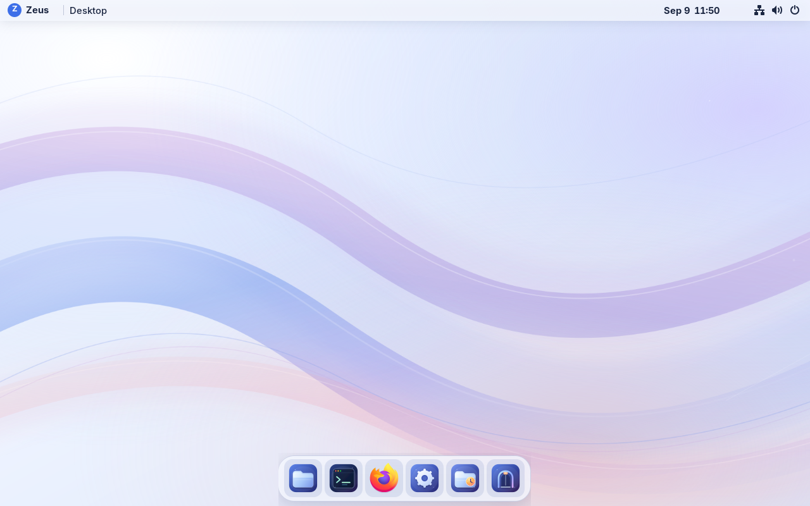
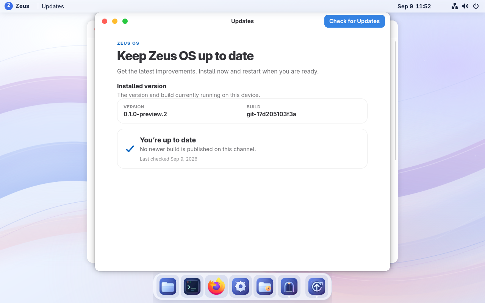
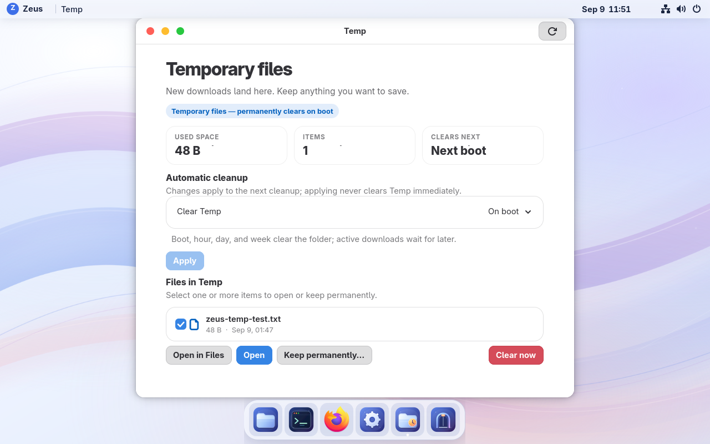
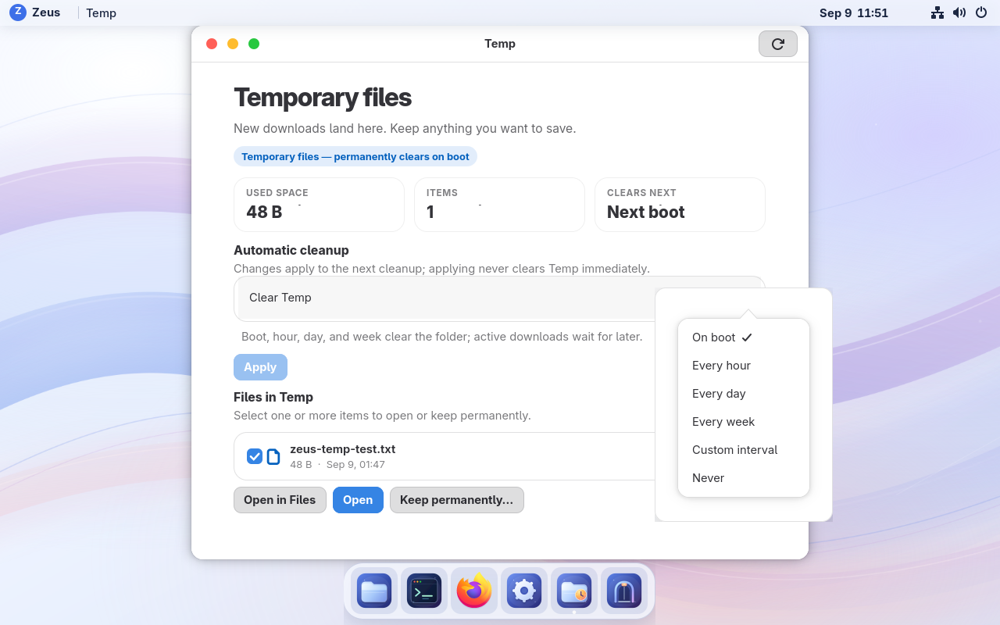
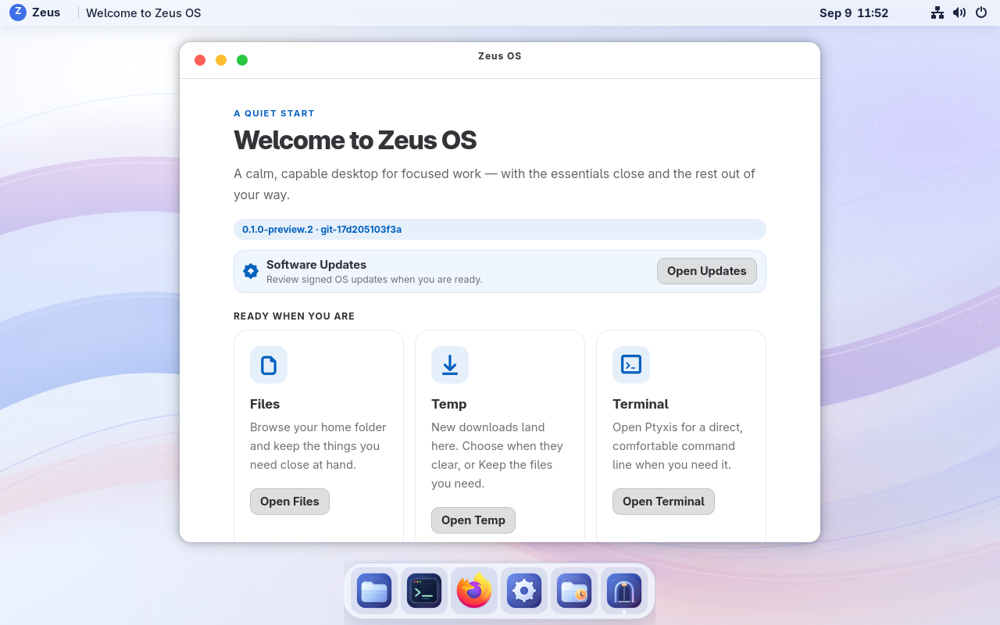

# Zeus OS screenshots — September 9, 2026

Captured from the running review VM 115, **0.1.0-preview.2**, build
**git-17d205103f3a**, at 1280×800. Tap an image title to open the full PNG.

[Desktop — translucent top bar, floating dock and Zeus artwork](desktop.png)

[Updates — signed build checks and installation](updates.png)

[Temp — next cleanup time and Keep permanently](temp.png)

[Cleanup options — On boot, hourly, daily, weekly, custom or Never](temp-options.png)

[Welcome — quick access to Updates, Files, Temp and Terminal](welcome.png)

Only windows and menus were opened for these captures. The existing Temp
policy and file status matched before and after. [Capture metadata](capture-info.json)
records the image hashes and file-write timestamps.
